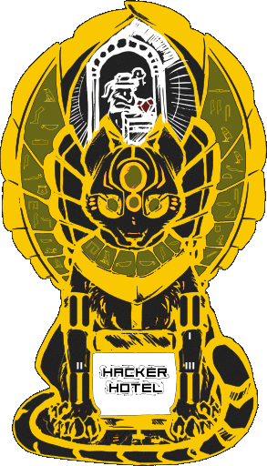

## Mixed reality

Since the Hackerhotel 2020 badge game features some mixed reality elements, you will run into some parts in the game where you will need interact with some elements that were only available during the event.

This page will assist you in working around those challenges so you can complete (or start) the game on your own.

## The magnetic maze
When you have read the picture frame in the reception, the hall sensor on the badge is activated to play the magnetic maze in the recption of the real hotel. As you don't have access to the picture frame with the magnetic maze, here is a picture of it with the magentic orientation of all the magnets behind the hieroglyphs. Use a (strong) magnet to enter a sequenze of N/S orientations to the badges Hall sensor.
Please note that it does not matter if you start with N or S, the game just looks for a sequence of same/different magnetic fields.

## Connecting to other badges (sometimes referred to as badge-sex)
During Hackerhotel, jack-2-jack cables were available to connect the badges together. We devided all badges in four types (Anubis, Bes, Thonsu and Thoth). You had to connect to all three other badge types to form a team. Without being a team, the Guard in the Dungeon will not give you the hints you need to decide what to offer at the Altar.

If you have not been able to connect to all the other badge types, there is a cheat code that can be used to simulate that you did. Enter `#124W9` in the game to make sure your badge thinks it has connected to all other badge types so that you can continue the game in the Dungeon.

## Make the right offering to the high-priest
In the dungeon you will encounter a guard and an altar. The guard gives you some hints, but you need the hints given to all 4 badge characters to solve the puzzle and make the right offering to please the high-priest. So to be able to solve this puzzle on your own, here are the 4 parts of the hints that are given to each badge character:

Anubis receives the following hints from the guard:

* Khonsu will offer Incense
* The one who kneels 3 times will bring element Water.

Bes receives the following hints from the guard:

* Khonsu will kneel more than once.
* The one who offers Incense will bring element Fire.

Khonsu receives the following hints from the guard:

* Bes will bring element Air
* Anubis will be kneeling once more than the one bringing element Earth

Thoth receives the following hints from the guard:

* Anubis will bring a Robe as offering, he will not kneel 2 times.
* The one bringing the element Air will offer something other than Fruit

When you do your offering, you will be asked how many times you kneeled and which element you will bring with you. This will result in a code that you will need later. Here is a python script that will generate the codes for you.

	#!/usr/bin/env python3
	  
	badges = ['a','b','k','t']
	badge = ""
	while not badge in badges:
	    inp = input("Are you [A]nubis, [B]es, [K]honsu or [T]hoth? ")
	    badge = inp.lower()[0]
	badge = badges.index(badge)
	
	offerings = ['w','r','i','f']
	offering = ""
	while not offering in offerings:
	    inp = input("Are you offering [F]ruit, [I]ncense, [R]obe or [W]ine? ")
	    offering = inp.lower()[0]
	offering = offerings.index(offering)
	
	elements = ['e','a','w','f']
	element = ""
	while not element in elements:
	    inp = input("Will you bring [A]ir, [E]arth, [F]ire or [W]ater? ")
	    element = inp.lower()[0]
	element = elements.index(element)
	
	kneelings = -1
	while kneelings < 0 or kneelings > 3:
	    inp = input("How many times did you kneel? ")
	    kneelings = int(inp)-1
	
	answer = ((offering  & 2) << 19) + ((offering  & 1) << 8) + \
	         ((element   & 2) << 15) + ((element   & 1) << 4) + \
	         ((kneelings & 2) << 11) + ((kneelings & 1))
	answer = answer << (3-badge)
	print("Your part of the code is {}".format(answer))

If you don't have python3 on your system, you can execute this code online at [https://repl.it/languages/python3]()

## Picture frames
There were two other picture frames spread accross the bar. Use at your own risk ;-)

## That's it folks...
With these hints and tricks you should be able to play the whole badge adventure!
Good luck and have fun!
