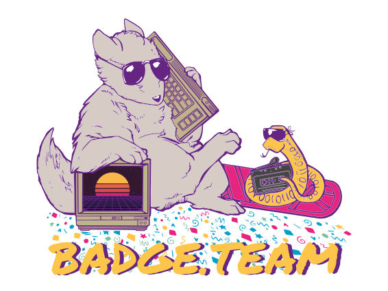



&nbsp;

<a class="btn btn-lg btn-primary mr-3 mb-4" href="">
Documentation <i class="fas fa-arrow-alt-circle-right ml-2"></i>
</a>
<a class="btn btn-lg btn-secondary mr-3 mb-4" href="https://t.me/+StQpEWyhnb96Y88p">&nbsp;
Need help? Want to volunteer? <i class="fab fa-telegram ml-2 "></i>
</a>

&nbsp;

Open source event badges for hacker events

&nbsp;





{}
We're a constantly changing group of volunteers that aims to take creating event badges to the next level! Are you interested in helping out, part of an event badge team looking for some help or just curious? Join our [Telegram group](https://t.me/+StQpEWyhnb96Y88p).
{}

{}

{}
Our main communication channel. Do you have a question? Want to help? Get in contact? 
<a href="https://t.me/+StQpEWyhnb96Y88p">Click here to join the Telegram group!</a>
{}

{}
Follow us on <a href="https://hsnl.social/@badgeteam">Mastodon</a> to be kept up-to-date on Badge.team related announcements and information
{}

{}
Contributions welcome! 
<a href="https://github.com/badgeteam">Our soft- and hardware designs are fully open source!</a>
{}

{}
