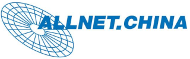
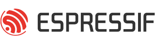
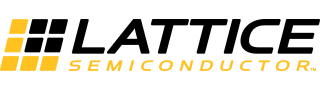
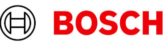
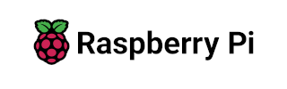
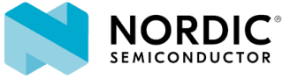
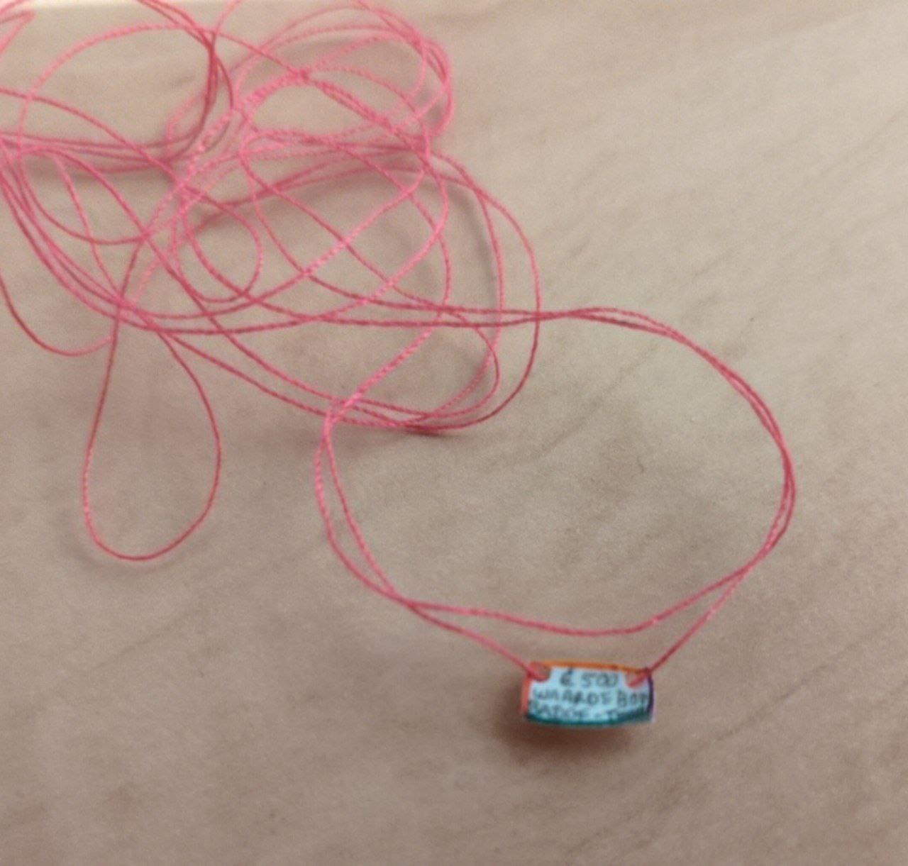

Happy new year hackers! A new year means new exciting projects... This year you will see us at Bornhack with an awesome new event badge, but this blog is about something even more important.

## Our sponsors

A huge thank you to our sponsors – You help make Badge.Team possible!

At Badge.Team, we work on building open, playful, and hacker-friendly technology that sparks creativity and connects the community.
Whether it's through custom hardware, firmware projects, or community experiences we help power, none of it would be possible without the contributions of our sponsors.

We would like to express our gratitude towards all who contributed in the past years, your contributions make it possible for us to keep enriching the community with wonderful badges, and be a home for those who have the desire to create, use, and want to learn about badges.

Without your support we would not have been able to become a foundation.
We are working on several projects for events this year and even the year after, please feel free to join our Discord stay up-to-date with what is happening and interact with the badge community.

  
  &nbsp;
  
  &nbsp;
  

  
  &nbsp;
  
  &nbsp;
  

## Creating possibilities

Sponsors are more than just logos on a banner.

By sponsoring Badge.Team you enable us to:

- Design inspiring event badges
- Connect makers
- Get engineers in contact with new and and interesting technologies
- Host community events and workshops at conferences and hacker camps
- Share knowledge and spark new projects
- Keep our projects open-source and accessible to everyone

## Donations

In addition to our corporate sponsors we want to give a huge thank you to all the people who donated to us this past year! Your contributions allowed us to set up a foundation with enough reserves to allow us to start our first projects as a formal organization.

 
Tiny cheque, huge value

## Thank You

To our sponsors: thank you for believing in us. Your support means the world to us and the community

We wish you all a happy and healthy new year,

### — With ❤️ Badge.Team

Would you like to sponsor us in the new year? You can contact us via Discord or by emailing us at [board@badge.team](board@badge.team)
