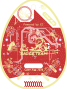
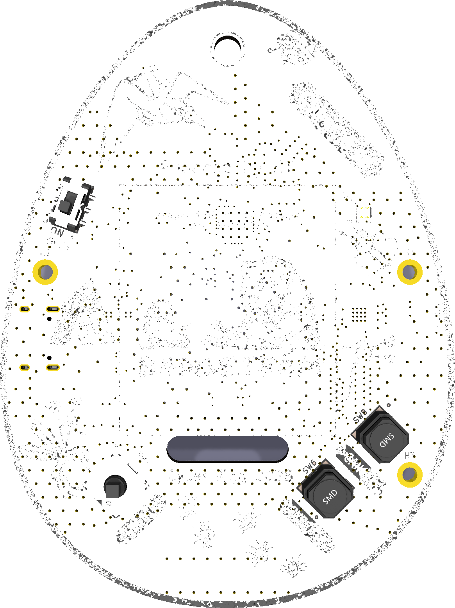
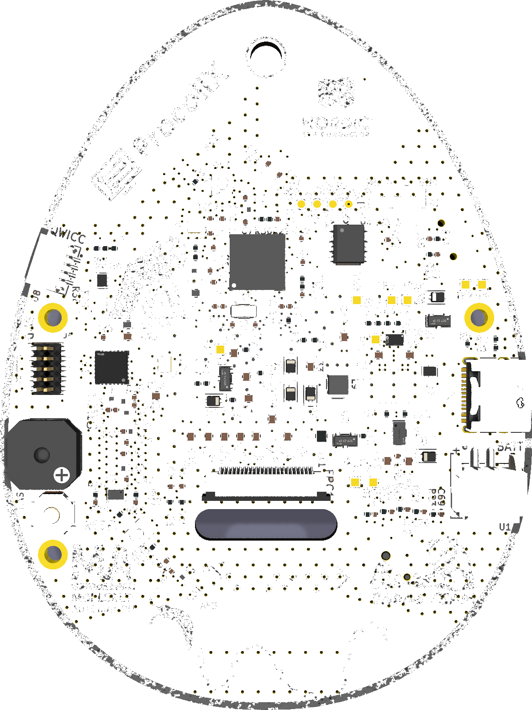
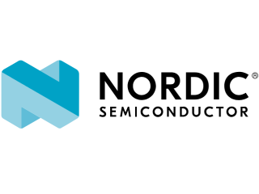
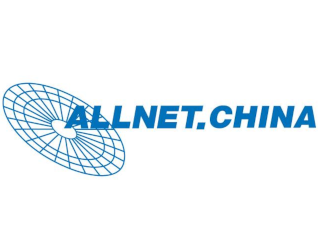
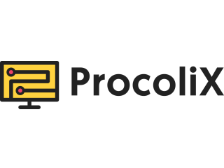
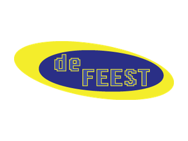
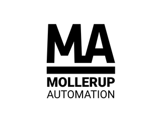

# Introduction

The BornHack 2026 badge is the **Cyber Ægg**: an egg-shaped, low-power hacker badge inspired by the 90's Tamagotchi. It is designed to run for the entire duration of the BornHack camp on a single battery charge, while keeping you connected to everyone else on the field over a long-range LoRa mesh.

Under the playful shell it is a serious little radio computer. A Nordic nRF52840 drives a 1.54 inch black/red/white e-paper display, talks Bluetooth Low Energy to your phone, emulates an NFC tag on its back, and reaches the wider [MeshCore](https://meshcore.io/) network through a dedicated SX1262 LoRa radio. To keep you entertained between messages there is **BornPets**, a virtual pet with a handful of mini-games.

  
  

<em>Front (display and buttons) and back (nRF52840, USB-C connectors, NFC coil).</em>

{}
There is a QWIIC like I2C expansion connector on the board. Be aware that we made a small design mistake: the 3.3v and GND signals have been swapped around. Make sure to use a modified cable before connecting any QWIIC peripherals.
{}

## Features

* Egg-shaped badge inspired by the classic Tamagotchi
* Nordic **nRF52840** microcontroller (BLE + USB + NFC)
* 1.54" **152 × 152** black/red/white e-paper display
* **SX1262** LoRa radio, part of the [MeshCore](https://meshcore.io/) mesh network
* Bluetooth Low Energy companion connection to the MeshCore app
* NFC tag on the back for location-based games and station taps
* 5-way joystick, `Select` / `Execute` / `Cancel` buttons, RGB LED and a piezo buzzer
* USB-C for charging and drag-and-drop file transfer

New to the badge? Start with the [Getting started](./getting-started/) guide. Curious about the virtual pet? See [Games](./games/). Want to know what is inside? See the [Hardware](./hardware/) page.

## Source code

The Cyber Ægg is open source. Both the hardware design and the firmware live on Codeberg:

* Hardware (KiCad) — [Ranzbak/bornhack2026-hardware](https://codeberg.org/Ranzbak/bornhack2026-hardware)
* Firmware (Rust / Embassy) — [Ranzbak/bornhack-firmware-2026](https://codeberg.org/Ranzbak/bornhack-firmware-2026)

# Hardware sponsors

  
  
  
  
  

* **Nordic Semiconductor** sponsored their low power yet very capable and fast [NRF52840][NRF52840] microcontroller with Bluetooth Low Energy and NFC, making it possible for us to build a device that runs on one battery charge, the whole camp long!
* **ALLNET China** is our production partner, they take care of sourcing most components and oversee the production process [in China][ALLNET China], saving us a lot of work and potential headaches and allowing us to focus on the product!
* **Procolix** sponsored the SX1262 LoRa radio chips, converting the badge into a capable LoRa communications device. Check out their [managed hosting solutions][hosting] for a truely sovereign cloud built on European open source solutions!
* **deFEEST** sponsored part of the badge hardware, helping us get the components we needed to build it. Find out more at [defeest.nl][deFEEST]!
* **Mollerup Automation** sponsored the 3D printed housing for the badge. They are automation, robotics and PLC specialists from Odense, Denmark — see [mollerup.info][Mollerup]!

[NRF52840]: https://www.nordicsemi.com/Products/nRF52840
[ALLNET China]: https://www.allnet.de/en/allnet-brand/unternehmen/weltweit/
[hosting]: https://procolix.eu/en/
[deFEEST]: https://defeest.nl/
[Mollerup]: https://mollerup.info/
