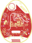
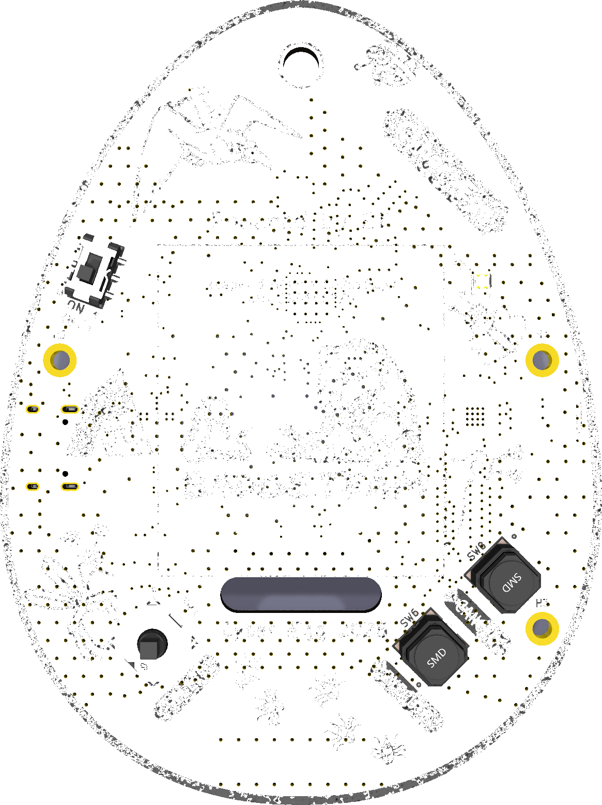
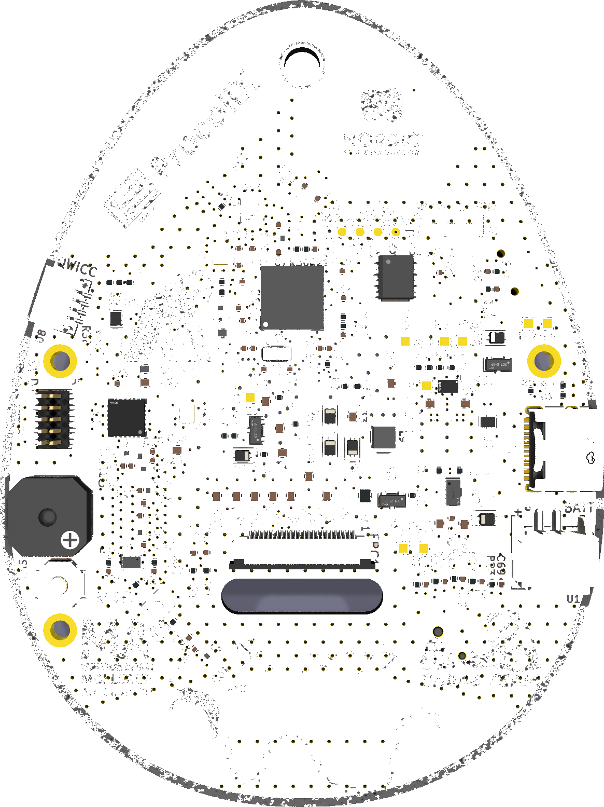
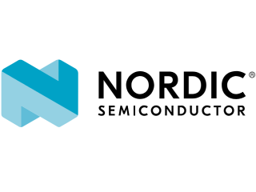
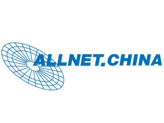
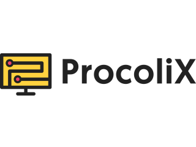
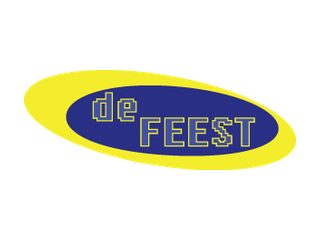
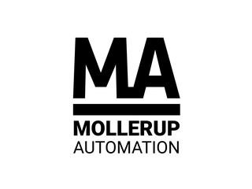

# Introduction

The BornHack 2026 badge is the **Cyber Ægg**. It is an egg-shaped, low-power hacker badge, inspired by the Tamagotchi of the 1990s. One battery charge runs the badge for the full BornHack camp. A long-range LoRa mesh keeps you connected to everyone else on the field.

Under the playful shell is a serious radio computer. A Nordic nRF52840 drives a 1.54 inch black, red and white e-paper display. The badge talks Bluetooth Low Energy to your phone, and it emulates an NFC tag on its back. A dedicated SX1262 LoRa radio connects the badge to the wider [MeshCore](https://meshcore.io/) network. Between messages, **BornPets** entertains you. BornPets is a virtual pet with a set of mini-games.

  
  

<em>Front (display and buttons) and back (nRF52840, USB-C connectors, NFC coil).</em>

{}
The board has an I²C expansion connector of the QWIIC type. We made a design mistake: the 3.3 V and the GND signals are swapped. Before you connect a QWIIC peripheral, make a corrected cable and use that.
{}

## Features

* Egg-shaped badge, inspired by the classic Tamagotchi
* Nordic **nRF52840** microcontroller (BLE, USB and NFC)
* 1.54 inch **152 × 152** black, red and white e-paper display
* **SX1262** LoRa radio, part of the [MeshCore](https://meshcore.io/) mesh network
* Bluetooth Low Energy companion connection to the MeshCore app
* NFC tag on the back, for location games and station taps
* 5-way joystick, `Select`, `Execute` and `Cancel` buttons, RGB LED and a piezo buzzer
* USB-C for charging and for file transfer with drag and drop

Start with the [Getting started](./getting-started/) guide. The [Games](./games/) page describes the virtual pet. The [Hardware](./hardware/) page tells you what is inside the badge.

{}
The [**Flash** page](./flash/) installs the firmware and the badge's asset files from a Chromium-family browser over USB. You need no toolchain and no command line. The page offers the standard firmware and the Community Edition, a fork with more BornPets mechanics.
{}

## Source code

The Cyber Ægg is open source. The hardware design and the firmware are on Codeberg:

* Hardware (KiCad) — [Ranzbak/bornhack2026-hardware](https://codeberg.org/Ranzbak/bornhack2026-hardware)
* Firmware (Rust / Embassy) — [Ranzbak/bornhack-firmware-2026](https://codeberg.org/Ranzbak/bornhack-firmware-2026)

The [Flash page](./flash/) also offers four alternative images. Each image has its own home:

* Community Edition — [ShadowSquad-org/BornHack-Cyberegg](https://github.com/ShadowSquad-org/BornHack-Cyberegg), a fork with more BornPets mechanics
* [DOOM](./doom/) — [rarenerd/cyberaegg-doom](https://codeberg.org/rarenerd/cyberaegg-doom), a bare-metal port of the DOOM engine
* [CircuitPython](./circuitpython/) — [rarenerd/cyberaegg-circuitpython](https://codeberg.org/rarenerd/cyberaegg-circuitpython), to program the badge in Python
* Bad Apple!! — [annejan/aegg-apple](https://github.com/annejan/aegg-apple), the animation on the e-paper panel with the tune on the buzzer

# Hardware sponsors

  
  
  
  
  

* **Nordic Semiconductor** sponsored their low power yet very capable and fast [NRF52840][NRF52840] microcontroller with Bluetooth Low Energy and NFC, making it possible for us to build a device that runs on one battery charge, the whole camp long!
* **ALLNET China** is our production partner, they take care of sourcing most components and oversee the production process [in China][ALLNET China], saving us a lot of work and potential headaches and allowing us to focus on the product!
* **Procolix** sponsored the SX1262 LoRa radio chips, converting the badge into a capable LoRa communications device. Check out their [managed hosting solutions][hosting] for a truly sovereign cloud built on European open source solutions!
* **deFEEST** sponsored part of the badge hardware, helping us get the components we needed to build it. Find out more at [defeest.nl][deFEEST]!
* **Mollerup Automation** sponsored the 3D printed housing for the badge. They are automation, robotics and PLC specialists from Odense, Denmark — see [mollerup.info][Mollerup]!

[NRF52840]: https://www.nordicsemi.com/Products/nRF52840
[ALLNET China]: https://www.allnet.de/en/allnet-brand/unternehmen/weltweit/
[hosting]: https://procolix.eu/en/
[deFEEST]: https://defeest.nl/
[Mollerup]: https://mollerup.info/
