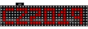

## Intro
Welcome, and congratulations with your brand new CampZone 2019 "I-Pane" event badge! This year's badge features an eye-killing RGB LED matrix, an extended 8MB flash ESP32 WiFi/BL microcontroller, and the wonderful multi-badge firmware platform by badge.team.

You can install apps from the (of course fully free) app store, and even write your own apps easily in Python that others can then install too![[File:Nyan revspace.png|thumb|center|CZ19 badge in full nyan cat glory, at Revspace.]]

The badge and it's firmware are located at: [https://github.com/badgeteam/cz19-badge GitHub.com/badgeteam/cz19-badge]

=Using your badge after CampZone=

## Getting started
Plug in your battery. The + and - are indicated on the circuit board. The positive terminal should point towards the USB connector. The badge has a protection circuit against reversing the battery, but it's best not to need it.

When you power the badge for the first time, it will first show a one-time intro screen. Afterwards, it will try to connect to WiFi. If connecting is successful, it will force a day-0 OTA update to get you the latest firmware. Otherwise, it will boot into a minimal firmware that allows you to setup WiFi and force OTA manually (and play snake!).

If the bottom entry in the launcher is 'Force OTA update', you're stuck in the initial firmware because the update failed. Keep running 'Force OTA update' until the update succeeds. Then, this entry will be replaced with the app 'Firmware update'.

After CampZone, you will need to update the WiFi settings to make the badge connect to your home network. This can be done with the "Set up WiFi" app on the home screen. If your badge still has the original firmware on it, it is easiest if you update it to the latest version first:

* Create a mobile WiFi hotspot with your phone, with SSID 'CampZone-IoT', and password also 'CampZone-IoT'. Run the Firmware Update app, and the badge should connect to your network and download the latest firmware.

On a recent firmware, you have a few options for configuring WiFi:

* Manually enter the login information through the Set up WiFi app. This will take a while.
* Connect your badge to your computer via USB (see section "Development option 2: offline coding via USB"), and in the USB menu select Settings > Configure WiFi.

The battery should be protected by an undervoltage protection, shutting down the badge in case of an empty battery. Possibly this implementation needs some TLC. Meanwhile do be aware that, when blue colors start to fade, the battery probably should be recharged (plug in the micro-usb)

=Launcher=
The badge boots into a launcher application, from which you can run all the apps you've installed.

You are able to remove apps which you install through the app store. System apps are non-removable. Source of these system apps can be found on the GitHub page: [https://github.com/badgeteam/new-esp32-firmware/tree/tom-cz19/firmware/python_modules/campzone2019]

### Brightness control
The left and right buttons in the launcher app control the badge's system brightness, which is persistent across reboots. You can save your eyes and also improve your charging time by lowering the brightness.

## Writing your own apps

### Introduction
This section introduces both MicroPython and the development process for your CampZone 2019 badge. If you are an absolute beginner we have also produced a pair of step-by-step tutorials that cover the basics of writing a "Hello World" app and loading it onto a badge.team badge.

* [[Tutorials/Your_First_Egg_(for_uGFX_badges)|Your first egg]]. Step-by-step, writing a simple Hello World egg.
* [[Simple_Egg_Deployment| Egg deployment for beginners]]. How to connect to your badge, and put code on it.

There are two different ways to write apps, which are explained in the next two sections.

### Development option 1: online coding in your browser
The 'hatchery' website is the repository for all badge.team compatible badges and their apps. You can easily write your micropython code there online and publish it so badges have access to it. Be sure to select the proper compatibility when creating your project so it will appear on the badges in the 'installer'.

Visit the Hatchery on https://badge.team, sign up for an account and have a look around. You can look into all projects there and borrow code from them. Create an app of your own with the "Add" button in the top right!

### Development option 2: offline coding via USB
Instead of working remotely via the Hatchery editor in your browser, you can also develop directly on your badge. This also allows you to tinker with your badge's internals. Detailed instructions per OS can be found below. Connect your badge to a computer using a Micro-USB cable, and connect over serial, 115200 baud. You should see a menu appear with various options. Select the Python Shell for now. You can type live python code here.

'''Mac'':
* Install the CH340 driver mentioned [https://github.com/badgeteam/new-esp32-firmware/tree/91fb211f46e71a5508d0c0d994054dac5a3005a8#build-instructions here].
* Check the address of your usb device by typing `ls /dev/` in your terminal, you'll get a list, one of the entries being your badge. It is probably something like `cu.wchusbserial1410`. To check which address belongs to your device, try disconnecting the badge and see which address is missing from the list after you run `ls /dev/` again.
* Open a serial connection with from Terminal like this: `screen /dev/cu.wchusbserial1410 115200`, replacing the address with the address of your device.
(You can exit with ctrl+a followed by k)

'''Linux'':
* Open a serial connection with from Terminal like this: `screen /dev/ttyUSB0 115200`.
(You can exit with ctrl+a followed by k)

For Windows you should be able to connect to the badge by using Putty:
* Install [http://www.wch.cn/downloads/CH341SER_ZIP.html CH340 driver].
* Download a terminal emulator, for example PuTTY.
* Lookup the badge's com-port number in device manager after connecting the badge over USB.
* Connect to the serial port and set baud-rate to 115200.

#### Paste mode
Hit Control-E for paste mode, paste in your code, hit Control-D to exit paste mode.

==APIs==
Most Python builtins work on the badge, so things like file reading/writing works as you would normally use in Python.

#### Buttons
Button clicks can be subscribed to with callbacks like this:
  import buttons, defines
  def my_callback(button_is_down):
    if button_is_down:
      # Do stuff
      pass
  buttons.register(defines.BTN_A, my_callback)

Valid buttons are BTN_A, BTN_B, BTN_UP, BTN_DOWN, BTN_LEFT, and BTN_RIGHT.

#### WiFi and web requests
The easiest and prettiest way to connect to WiFi is to run:
  import uinterface
  uinterface.connect_wifi()
This function draws animated connection icons to the display, and returns whether connecting was successful..

Once you have a WiFi connection, you can fetch the contents of a given URL with:
  import urequests
  result = urequests.get('https://my.url.com/example')

If the page you fetched is in JSON format, you can parse it using:
  parsed_object = result.json()

#### Display

Most current CZ apps still use the rgb module. For new code we recommend the more generic badge.team display API, see https://docs.badge.team/api-reference/display/ . You may or may not need to first disable the rgb module with `rgb.disablecomp()`.

All display features can be accessed through the rgb module.

First make the module available by adding to the top of your script:
  import rgb

After this, you will have access to the following functions:

  rgb.clear()
Clears all the render tasks. Keeps the background .
-----
  rgb.background((r, g, b))
(r, g, b) – RGB values for color. Each value should be between 0 and 255.

Sets the background color.
-----
  rgb.getbrightness()
Gets the display brightness.
-----
  rgb.setbrightness(brightness)
Sets the brightness to the specified value. Brightness ranges from 1 to 30.
-----
  rgb.framerate(framerate)
Sets the framerate to the specified value. Framerate ranges from 1 to 30fps.
-----

  rgb.pixel((r, g, b), (x, y))
(r, g, b) – RGB values for color. Each value should be between 0 and 255.

(x,y) – Coordinate of the display. 0,0 is in top left corner.

Places a pixel with the color rgb at x,y on the display.
-----
  rgb.text(text, (r,g,b),  (x,y))
text – String to display on the display. Most ascii characters are supported.

(r, g, b) – RGB values for color. Each value should be between 0 and 255.

(x,y) – (optional, defaults to center left) Coordinate of the display. 0,0 is in top left corner.

Places the specified text on the display where the top left corner of the text block is at x,y.
-----
  rgb.scrolltext(text, (r,g,b),  (x,y), width)
text – String to display on the display. Most ascii characters are supported.

(r, g, b) – RGB values for color. Each value should be between 0 and 255.

(x,y) – (optional, defaults to center left) Coordinate of the display. 0,0 is in top left corner.

width – (optional, defaults to whole screen) The width of the box in which to scroll the text.

Places the specified text on the display where the top left corner of the text block is at x,y. This text will scroll across the display. Specify the width if it shouldnt scroll across the whole screen.
-----
  rgb.image(data, (x,y), (w,h)
data – image data in a list with the format 0xrrggbbaa (red, green, blue, alpha).

(x,y) – x,y coordinate of display where the top left corner of the image should be.

(w,h) – width and height of the image.

Renders an image on the display at the specified coordinate.

''Example:
  rgb.image([0x00FF00FF, 0x0000FFFF, 0xFF0000FF], (0,0), (3,1))''
-----
  rgb.gif(data, (x,y), (w,h), frames)
data – image data in a list with the format 0xrrggbbaa (red, green, blue, alpha).

(x,y) – x,y coordinate of display where the top left corner of the image should be.

(w,h) – width and height of the image.

frames – number of frames in the gif.

Renders animated image on the display. The speed of the animation is locked to the framerate.

''Example:
  rgb.framerate(1)
  rgb.gif([0x00FF00FF,0x00FF00FF,0x00FF00FF, 0xFF0000FF, 0xFF0000FF, 0xFF0000FF], (0,0), (3,1), 2)''
-----
  rgb.setfont(font)
Change the font. Set to rgb.FONT_7x5 for the 7x5 monospace font and rgb.FONT_6x3 for 6x3 proportional font.
-----
  rgb.textwidth(text)
Gets the width of the supplied text in pixels, given the current font.

====Advanced====
If the following commands dont provide a low enough level of access to the display. It is possible to disable the render engine and write directly to the framebuffer from python.

  rgb.disablecomp()
Disable the compositor. The compositor renders the text/images/etc to the framebuffer.

  rgb.enablecomp()
Enable the compositor.

  rgb.frame(data)
data – frame data in a list with the format 0x00rrggbb.

Writes directly to the framebuffer of the display. Disable the compositor before doing this else it gets overwritten

#### File system and persistent data
Using the normal 'open()' function, you can read from and write to files on the badge's FAT filesystem.

The filesystem structure is as follows:
/apps -> user-installed app store apps
/cache -> temporary files used for caching data
/lib -> reserved
/config -> reserved

Additionally, you can store short strings and (integer) numbers like this:
  import machine
  machine.nvs_setstr('my_namespace', 'my_keyname', 'someStringValue')
  data = machine.nvs_getstr('my_namespace', 'my_keyname')

  machine.nvs_setint('my_namespace', 'my_keyname', 1337)
  data = machine.nvs_getint('my_namespace', 'my_keyname')

## WiFi Settings
The badge is preconfigured for the Campzone WiFi, SSID 'CampZone-IoT' Pass 'CampZone-IoT'. If you want to use the badge at home, do the OverTheAir Update on the campsite so the WiFi settings app works without bugs ;)

To configure from the terminal, open a Serial terminal (115200) and choose 'python shell'.

 import machine
 machine.nvs_setstr("system", "wifi.ssid", "YOUR SSID HERE")
 machine.nvs_setstr("system", "wifi.password", "YOUR PASSWORD HERE")

If you use a SSID without a password, then blank the wifi password setting:

 import machine
 machine.nvs_setstr("system", "wifi.password", "")

Reboot and it should 'just work' (if you have done the OTA). Else make an accesspoint with the CampZone-IoT as SSID and Password, do the OTA and THEN use your badge properly.

## Hardware mods
### Capacitor for operation without battery
Without battery, powered just by USB, the badge only work when the brightness is set to a low value. The badge is initially configured with high brightness.

In order to use the I-Pane badge at high brightness without the battery on just USB, you can solder in the capacitor that is included in your bag (470 Uf). Please note the capacitor is polarized, the negative terminal (short wire, white marking on capacitor) should point towards the Campzone/Deloitte logo.

*Before you begin, unplug USB cable and remove battery.
*Bend and cut the leads and solder in place.

[[File:IMG 3886.jpeg|200px]] [[File:IMG 3887.jpeg|200px]]

### Ultra bright LEDs
Replace 6 resistors and burn your eyes even further. More details soon!

=Tips & Tricks=
### App Store won't load
Cause: Possible corrupt App Store cache

Solution: force refresh cache

Open a python shell (see chapter 'coding via USB') and execute the following:
 import uinterface, woezel, machine
 machine.nvs_setint('system', 'lastUpdate', 0)
 uinterface.connect_wifi()
 ## Check if return is True!!
 woezel.update_cache()

### Diffuser
[[File:Campzone diffuser.jpg|thumb|A diffuser for the CZ19 badge, that turns round pixels into pretty square ones.]]

You can 3d print your own diffuser that turns the round pixels into large and pretty square ones. Several diffuser designs were made, and are accessible on Thingiverse:

* [https://www.thingiverse.com/thing:3782726 By zeno4ever]
* [https://www.thingiverse.com/thing:3792899 By Damning]

### Power Switch
[[File:Switch.jpg|thumb|A power switch for the CZ19 Badge]]

Another mod is adding a power switch to your CZ19 badge. Details on the easy 3D print and installation can be found on Thingiverse:

* [https://www.thingiverse.com/thing:3792433 By quintixbox]

## The Coin

The coin used to acquire the campzone 2019 badge is also the pcb for an acceleratometer/gyro and temp sensor. For this the common MPU-6050 is used. If you were unable to solder said coin during Campzone the following parts are necessary:

* 1x MPU-6050
* 1x 2.2nF 0603 capacitor (C1)
* 2x 100nf 0603 capacitor (C2 & C3)
* 1x 2x3 pin header

A big warning should be give when trying to solder this PCB. Soldering QFN is very difficult and will require the use of a hot air station. Try on your own risk

When the text is oriented horizontally and upright pin 1 of the MPU can be found in the top left corner. This is also where the silkscreen slightly differs.

[https://github.com/jorisplusplus/MPU_Coin/tree/master/Coin Schematic/layout can be found here]

## Acknowledgements
This badge was only possible because of the help of wonderful people. Thanks to:
* Badge.team for awesome base firmware
* Renze specifically for very nice collaboration on the freshly written new base
* Sebastius for being an enormous help with organising, promoting, packaging, and for helping staying sane
* Anne Jan for help with the hatchery integration
* The HackZone badge team
* Joris specifically for immediately jumping onboard upon our cry for help with the HUB75 led driver
* All the badge packaging sweatshop volunteers
* Revspace for being a wonderful host during the sweatshops
* Deloitte, Espressif, and AllNet for believing in the badge's beauty and coming up with the huge sponsoring we needed

Credits for the nyan cat animation go to Bertrik Sikken, and was based on the Revspace LED banner animation collection.

## Connecting

Install screen:

<code> sudo apt install screen </code>

Then add yourself to the network users

<code> sudo usermod -a -G dialout -currentUser- </code>

login or reboot

then connect and switch on the badge.

Then in the terminal execute the following:

<code> screen /dev/ttyUSB0 115200 </code>

## The team

The CampZone 2019 badge would not have been possible without the help of these amazing volunteers.

 - Tom Clement: hardware
 - Roel Harbers
