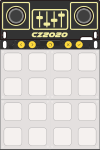

## Available Python API modules

* [Keypad](/docs/esp32-app-development/api-reference/keypad/)
* [Display](/docs/esp32-app-development/api-reference/display/)
* [Audio](/docs/esp32-app-development/api-reference/audio/)
* [WiFi](/docs/esp32-app-development/api-reference/wifi/)
* [HID](/docs/esp32-app-development/api-reference/hid/)
* [MIDI](/docs/esp32-app-development/api-reference/midi/)
* [Touchpads](/docs/esp32-app-development/api-reference/touchpads/)
* [ugTTS](/docs/esp32-app-development/api-reference/ugtts/)
* [Appconfig](/docs/esp32-app-development/api-reference/appconfig/)
* [System](/docs/esp32-app-development/api-reference/system/)
* [Consts](/docs/esp32-app-development/api-reference/consts/)
* [uMQTT](/docs/esp32-app-development/api-reference/umqtt/)
* [Sndmixer](/docs/esp32-app-development/api-reference/sndmixer/)

## The team

The CampZone 2020 badge would not have been possible without the help of these amazing volunteers.

 - Tom Clement
