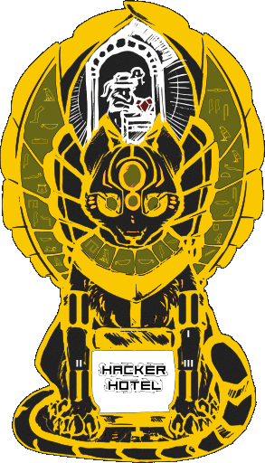
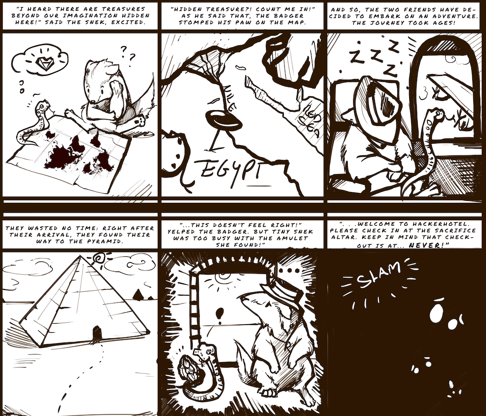
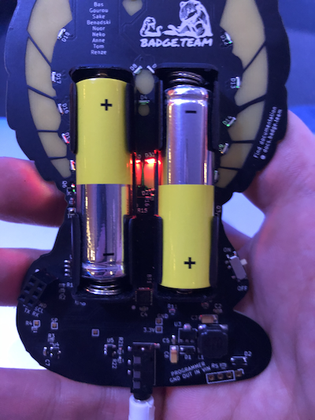
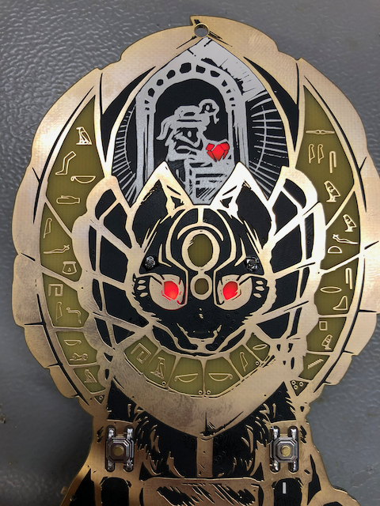

## The project

Welcome to Hackerhotel 2020, where you may check-out any time you want but you may never leave...

...just kidding of course, but our Egyptian cat goddess badge will be watching over you both during and after the event.

This badge is a bit different from our other badges: it's a challenge badge. No apps, no Python, but instead a story for you to experience filled with puzzles and lore!

The Hackerhotel 2020 badge is a mixed reality escape room. Reminiscent of the classic 'text adventures' but with interactions in the real world, it will present you with many challenges to overcome in both the virtual and the real hotel. 

## The story so far...

Want a big version to make a poster? Click [here](Comic140x120_big.png)

## In the bag
Your badgekit contains all the essentials:
* badge
* lanyard
* batteries

If you forgot to bring your USB to Serial adapter, you can pick one up at the badge hacking area if needed. We didn't buy 350 of them, so please only pick one up if you need one!

The same goes for the headphones. They won't be in the bag, but pick up a pair if you need one. Note: ours won't be as nice as the one you already have!

## Getting started

Did you just receive your badge at the event? Great! Plug in the batteries and you can start playing the minigames on the badge right away. There are four buttons on the front of the device using which you can control the games. Good luck figuring out how it works, as we're leaving that part as a little secret!

Please pay attention to the batteries when plugging them in. Orient them like so:

Before plugigng in shitty addons please read the notes mentioned in the Errata section of this page!

Please do not bring front of badge in contact with anything metallic. All exposed metal is GND, and the battery-terminals poke out. Short them: battery overheats. When storing badge: please remove batteries. 

## Playing the game

To play the "escape from Hackerhotel" challenge you need to connect your badge to a computer. You can do this by connecting a USB-serial converter with 3.3 volt signal levels to the GND, RX and TX pins of the shitty-addon (SAO) connector. The TX pin is the pin transmitting data to your computer, the RX pin is for sending data from your computer to the badge.

The badge will present you with a text entry prompt when you connect to it using a terminal emulator configured for 115200 baud, 8-bit data width, no pairity bit and 1 stop-bit (115200 8n1). You might have to type an "h" followed by ENTER to get the badge to show it's prompt.

### Installing a terminal emulator
  - [On Linux](connecting-linux)
  - [On Windows 7, 8 and 10](connecting-windows)
  - [On macOS](connecting-mac)

## Errata
Some mistakes were made both in the design and during assembly, which we couldn't fix in time for the event.

## Troubleshooting
### 3 red lights

Two red eyes and a red diamond an an unresponsive badge are the notification that the EEprom has been corrupted. Either you broke it, the code broke it, or it was another fault. No worries, visit a friendly Badge.team member and they can program that chip for you in under 15 seconds!
 

### SAO
The SAO (shitty add-on) connector has been placed on the bottom of the badge, while it was intended to be placed on the top side. This means that the pinout of the SAO connector is mirrored when compared to the SAO specifications. The pinout mentioned on the silkscreen of your badge does properly match the connector, so no worries there. Should you want to plug in a shitty-addon, then you will have to remove and replace the connector.

At the badge assembly, both during Hackerhotel 2020 and during future events where we attend we will be sure to take some extra SAO connectors with us, together with the necessary equipment for doing this small rework step.

### Undo the rework (if you want to)
Other mistakes are more visible, but less obvious: we've mirrored the pinout of the LEDs on this badge. To work around this issue we've removed the N-mosfets used to drive the LED-matrix and replaced them with bodgewires. To get the most light intensity out of your badge and to restore your badge to it's full potential you can flip the leds (they're symmetric), solder some SOT23 N-mosfets back in place and re-flash the firmware to drive the LED-matrix the right way round. Doing this rework takes a lot of time (30 minutes or more), but we're glad to be of assistance should you want to attempt this.

Get the firmware (To be released after event) and go to `resources.h` and enable `#define PURIST_BADGE` and flash following instructions.

You can find a manual for fully reworking your badge [here](rework-manual).

### CYBER SCARAB
Our friends at Tilde Industries made a very nice addon for the badge. [Find out more on their website.](https://tilde.industries/cyber-scarab/)
