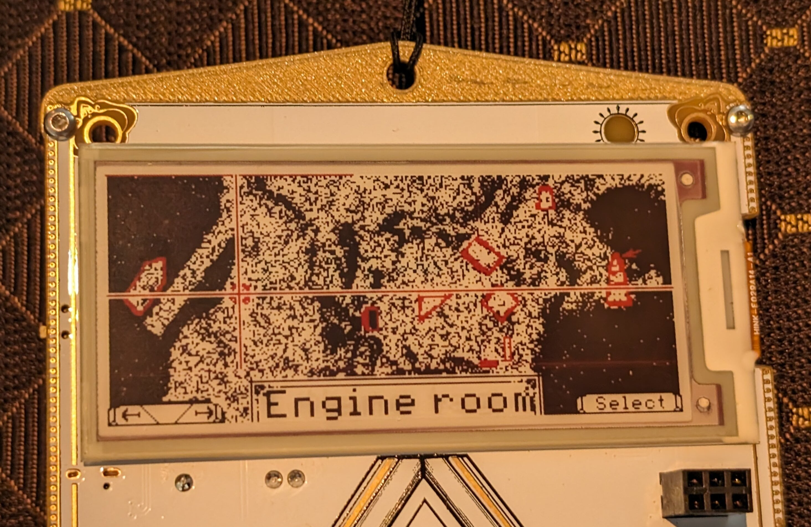

<p align="justify">
  
  
</p>

The Telegraph badge made for the event Hackerhotel 2024 is an interactive badge with puzzles themed telegraphs and the Victorian historical setting they were developed in. It is inspired from the Cooke and Wheatstone telegraph for the rather unusual input system. 

# Hardware

 - ESP32-C6 microcontroller module with WiFi 6, BLE and 802.15.4 mesh networking
 - Epaper screen with 296 x 128 resolution and both red and black ink
 - Five three way switches for control
 - LED matrix for telegraph style keyboard interface
 - SAO connector
 - QWIIC connector
 - Addressable LED used as status indicator

# Handbook

### First steps
First turn the badge by sliding the switch down on the left hand side or plugging in a cable in the USB C port (this also recharges the battery).

⚠️ The display is e-paper and its behavior can be confusing under some conditions:
- The screen state does not change when turned off, so it will show its current screen until it is powered up again.
- When sliding the switch down to turn the device on (while unplugged) the top right corner LED should flash. If it does not then the battery is discharged and the screen will remained unchanged.
- The screen will sometimes cycle the ink before displaying the image, this can be changed for most menus in the "engine room".

### Using the input system
The inputs consist of 5 switches located at the bottom of the badge, each having 3 actions: rotate left, rotate right and press in. The effect of those actions is often described by the boxes at the bottom of the screen.

If you enter the typing mode, the device then function as a [Cooke & Wheatstone telegraph]([url](https://en.wikipedia.org/wiki/Cooke_and_Wheatstone_telegraph#Operation)): Each switch represent one of the needles, and the led line shows the needle orientation. when 2 needles point towards the same letter, it is registered.

<a href="http://www.youtube.com/watch?feature=player_embedded&v=OJWbZAmNXz4" target="_blank">
 
</a>

### Navigating the apps
All the different applications and games are accessible via the map menu, rotate the left switch to change "location" (aka apps) on the map, and select by pressing in the right switch in:
<p align="justify">
  
</p>

# Hardware sponsors

<p align="justify">
  <a href="https://www.allnet.de/en/"></a>
  <a href="https://www.espressif.com/"></a>
  &emsp;&emsp;&emsp;&emsp;&emsp;&emsp;&emsp;&emsp;&emsp;&emsp;
</p>

* **ALLNET China** was our production partner, for which we are more than grateful. They took care of sourcing most components and oversaw the production process in [China](https://allnetchina.cn), saving us a lot of work and potential headaches and allowing us to focus on the product!
* **Espressif** was very generous to donate us all of the [ESP32-C6](https://www.espressif.com/en/products/socs/esp32-c6) modules we needed. The ESP32 series of WiFi capable microcontrollers has proven itself to be a solid basis for badges in the past. Espressifs continued support means a lot to us as it allows us to continue expanding our existing ESP32-based ecosystem!

# Resources

 - [Repository of hardware design files](https://github.com/badgeteam/hackerhotel-2024-hardware)
 - [Repository of ESP32-C6 firmware](https://github.com/badgeteam/hackerhotel-2024-firmware-esp32c6)
 - [Repository of CH32V003 firmware](https://github.com/badgeteam/hackerhotel-2024-firmware-ch32v003)
 - [Repository of SAO designs](https://github.com/badgeteam/hackerhotel-2024-sao)
 - [3D printable case](https://www.printables.com/model/744855-hackerhotel-2024-badge-cover-and-lanyard-adapter)

# The team

The HackerHotel 2024 badge would not have been possible without the help of the following amazing volunteers:

 - [Nikolett](https://ankhaneko.art)
 - [Guru-san](https://tilde.industries)
 - [Renze](https://nicolaielectronics.nl)
 - [Tom Clement](https://curious.supplies)
 - CH23
 - [Norbert](https://allnetchina.cn)
 - Zac
 - SqyD
 - Martijn
 - Julian
 - [Dimitri](https://hackerhotel.nl)
 - [Yvo](https://ytec3d.com)
   
 # Reporting bugs
 If you find any bug, help us by filling [an issue.](https://github.com/badgeteam/hackerhotel-2024-firmware-esp32c6/issues)

# Ready, set, hack!
Hack your badge and build cool applications on the ESP32-C6! Here are some basic instructions to get you started:


## Add and display an image png
First the convert your image (input.png) by running <samp>convert</samp> using the mascot.png in the ressource folder as a reference, example:
```
convert input.png -map mascot.png output.png
```
Then open main/CMakeLists.txt and add your new file:
```
EMBED_FILES ${project_dir}/resources/output.png
```
Add in your file:
```
extern const uint8_t output_png_start[] asm("_binary_output_png_start");
extern const uint8_t output_png_end[] asm("_binary_output_png_end");
```
And use <samp>pax_insert_png_buf</samp> in your code to add the image to the screen buffer:
```
pax_insert_png_buf(&gfx, output_png_start, output_png_end - output_png_start, 0, 0, 0);
```
