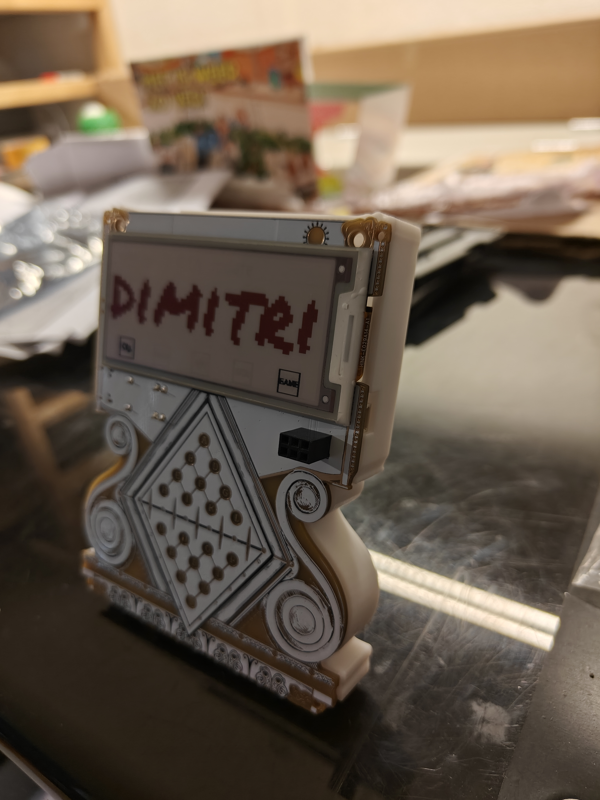
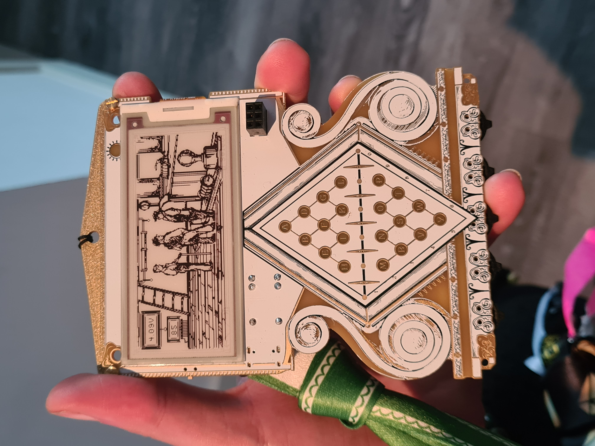
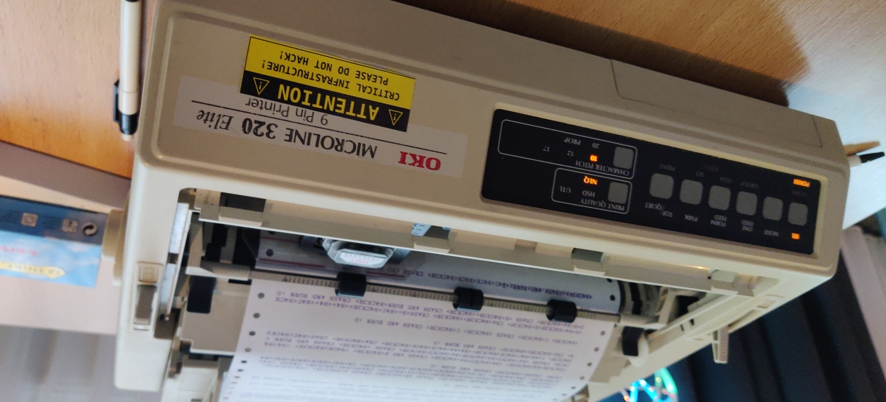
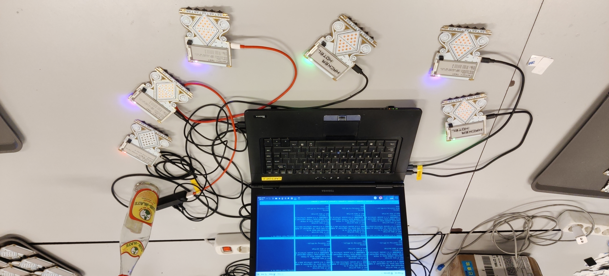

The badge:

  
  
  

During the event a dot-matrix printer was busy printing all of the messages sent via the billboard messaging system.

  

Preparation for the event happened at Bitlair, where we flashed and tested all of the badges:

  

