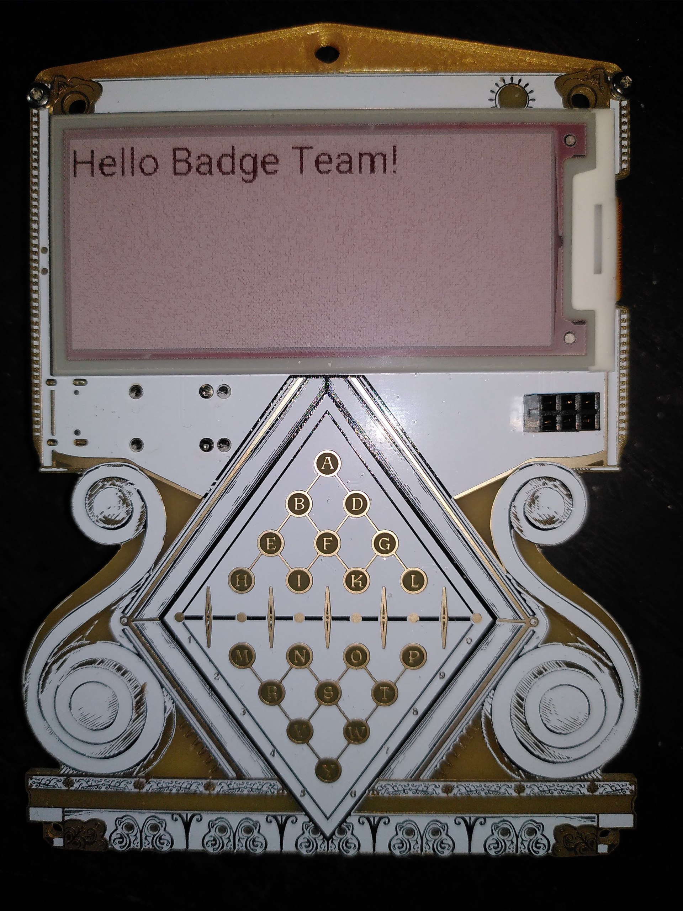

# Introduction ...

The Badge is basically an ESP32C6 development platform and features the
following methods for developing software:

- **Stock firmware build-IDF** : native EPS apps using the IDF (IoT Development
  Framework)
- **ESP-IDF with Platformio** : 
- **EspHome**: The easy way to program devices for Home-Assistant.

See more information below.


## Linux permissions

Regardless of the way you're going to program the badge, to connect to the
badge over USB from Linux, do the following.

Create `/etc/udev/rules.d/99-mch2022.rules` with the following contents:

```
SUBSYSTEM=="usb", ATTR{idVendor}=="16d0", ATTR{idProduct}=="0f9a", MODE="0666"
```

Then run the following commands to apply the new rule:

```
sudo udevadm control --reload-rules
sudo udevadm trigger
```

## Windows installation

Not tested.

# Software Platforms 

### Badge Team default firmware

You can find the official firmware here: 
https://github.com/badgeteam/hackerhotel-2024-firmware-esp32c6
You can build and upload the original firmware by cloning the archive and using the 
following commands: 

```
make prepare
make build
make install
```

### ESP-IDF with Platformio

Jhaand ported the `Hello World` application for ESP-IDF to Platformio and made
it easy to put your own program on the HH2024 badge with ESP-IDF. 

https://gitlab.com/jhaand/hh2024_hello_platformio

This will only put some information on the UART `/dev/ttyACM0` at 115200
and restart.

### ESPHome
SqyD started integrating the HH2024 badge into ESPhome. Which makes
things easy to integrate with
[Home-Assistant](https://homeassistant.io) domotics.

You can find the yaml file for the HH2024 badge here:  
https://gist.github.com/SqyD/d33b034c42dbc277ebb928ae45663476

It displays a `Hello Badge Team!` on the display.
<p>

</p>

More information on install EspHome you can find here:   
https://esphome.io/guides/getting_started_command_line


