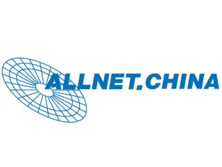

# Konsool

Back in 2022 we built you a handy games console, pushing the limit's of what is possible using the original ESP32 microcontroller and even going above and beyond by adding an FPGA into the mix.

This time Konsool will be completely different of course! The device will be the portable computer you wish you had in the 80s. Complete with on-device programming environment, a big screen and a full QWERTY keyboard this device is all the computing power you will need during the event.

## The brain

The brand-new ESP32-P4 will be the star of the show, with it's dual-core 400MHz RISC-V processor, 32MB of RAM and plenty of peripherals for communication the badge will be a showcase of state of the art IOT technology.

WiFi, Bluetooth and even 802.15.4 mesh networking are available thanks to the ESP32-C6 module included on the board.

## The plan

# Hardware sponsors

  
  
  &emsp;&emsp;&emsp;&emsp;&emsp;&emsp;&emsp;&emsp;&emsp;&emsp;

* [**ALLNET China**][ALLNET China] is our reliable production partner. They took care of sourcing most components and oversaw the production process in China, saving us a lot of work and potential headaches and allowing us to focus on the product!
* [**Espressif**][Espressif] has very generously sponsored ESP32-P4 chips, ESP32-C6 modules as well as the flash chips to store the firwmare. The ESP32 has proven itself to be a solid basis for badges in the past. Espressifs continued support means a lot to us as it allows us to continue expanding our existing ESP32-based ecosystem!

All of our sponsors helped us out in a time when sourcing capable chips was a near-impossible task. Without them, this project would not have been possible. We are grateful to all of them for their help and sponsorship, and we hope to work with them again in future badge projects!

[ALLNET China]: https://www.allnet.de/en/allnet-brand/unternehmen/weltweit/
[Espressif]: https://www.espressif.com/en

## The team

The Konsool would not have been possible without the help of our amazing volunteers.

r3nz3 (Renze Nicolai) - Hardware and Software development
Ranzbak (Paul Honig) - Hardware, Testing and Documentation
Jhaand (Jelle Haandrikman - Testing and more
RobotMan2412 (Julian Scheffers) - Software and Testing
Schrodinger'sFestiveKat (Nikolett) - Artwork and more
Orange Murker (Luna) - Software and Testing
NightOwlNL (Emiel Bart) - Documentation
Noor
Joyce NG
Anus (Anne Jan Brouwer)

