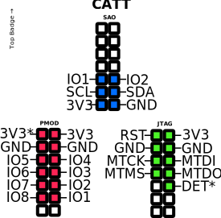

## Description

The CATT connector combines several different connectors in one.

- Special Addon (SAO)
- JTAG
- PMOD

Because of this multi functional nature, the name for the connector is CATT (Connect all the things), even though there are more kind of things to connect.

## Schematic

## SAO

- *DET: Detect, when pulled down during power up, JTAG functionality is provided
- *3V3: Not connected by default, jumper the PCB needs to be closed to apply 3V3