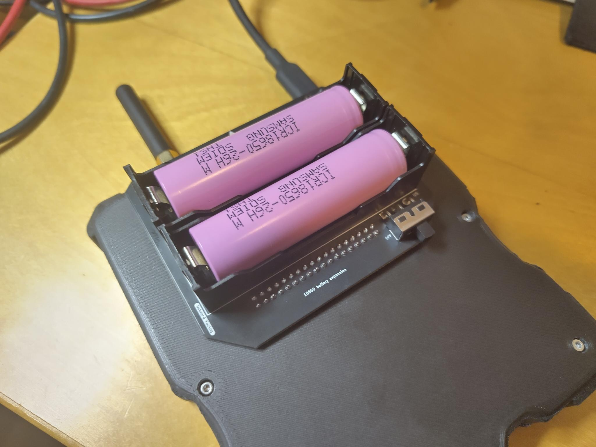
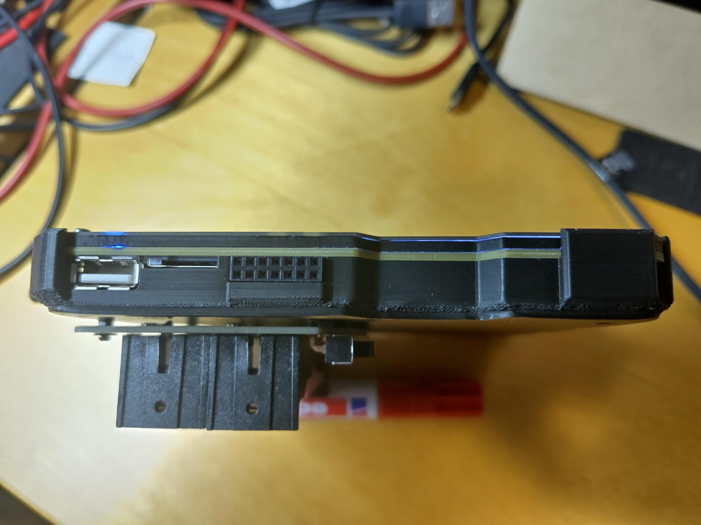
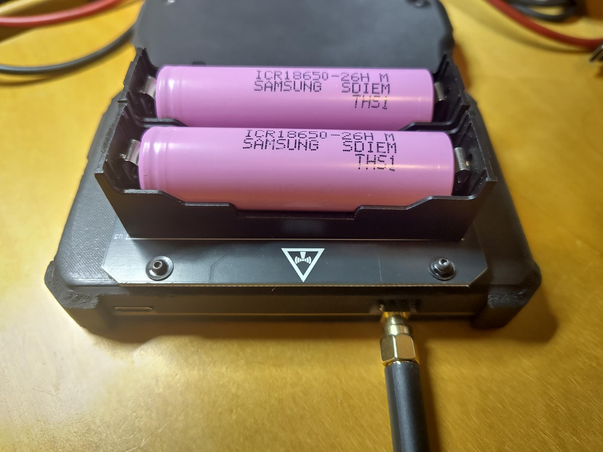

# 18650 Extension

## Introduction

Simple extension that attaches to the extension port at the back, and contains 2 18650 cells.
This extends the battery time for the Konsool / Tanmatsu badge with several hours.

The extension features protection IC's for both cells individually, to minimize risks related to the lithium batteries.

## Features

- Protection IC per 18650 CELL
- On/Off switch
- Charges off the USB-C power from the Konsool/Tanmatsu
- M2 mounting holes to fasten the battery holder securely

## Project

The project can be found [here](https://github.com/badgeteam/konsool-18650-expansion) on Github.

## Maturity

A prototype run has been done, and the hardware has been tested on a Tanmatsu V4 prototype (See pictures below).

## Real life pictures

    
    
    

