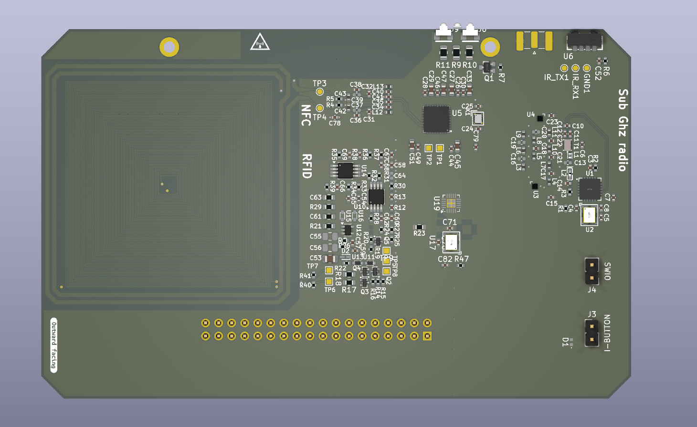
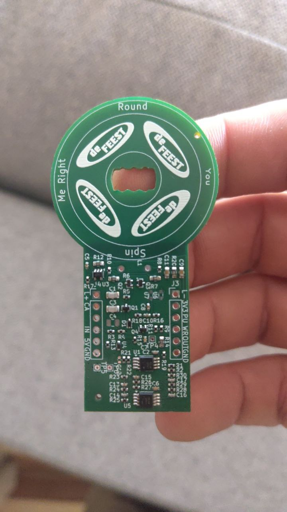
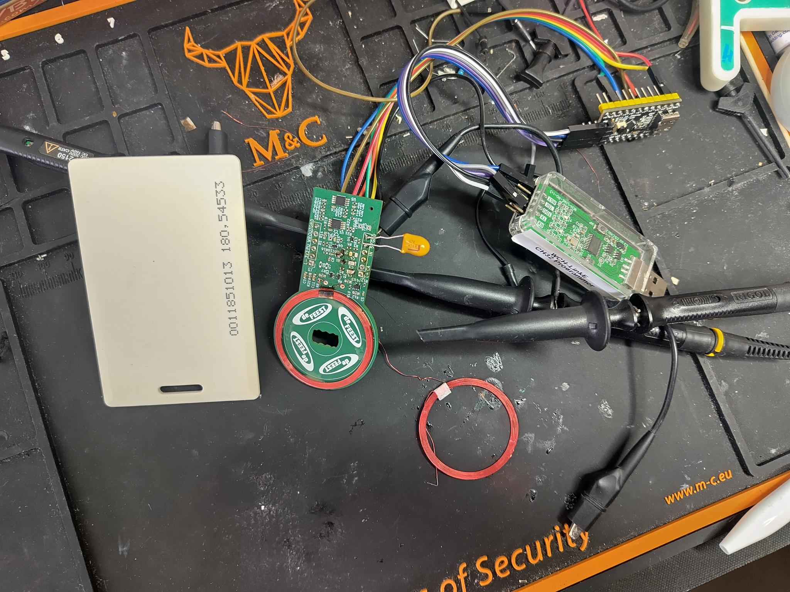

## Introduction

The Konsool has al lot of capabilities already in a pretty handy form factor.
To take advantage of the keyboard, powerful CPU to for example play with technologies
like NFC, RFID and sub GHz radio extra circuitry is required.

Even though this idea is not my own (thanks Renze) I do feel motivated to make this
board given my interest in lock and security related subjects.

## Disclaimer

It is important that this device is used for educational purposes only, the only
locks that should be opened are either your own or with express permission of the owner of said lock.

The goal of this device is to improve security and educate, not do enable illegal activities.

I the designer do not take any responsibility for the how this device is used, if you
manage to get into trouble using this device the responsibility is your own.

## Planned Features

- 100 - 150 kHz RFID tag reading and writing
- Sub GHz radio capabilities using [CC1101](https://www.ti.com/lit/ds/symlink/cc1101.pdf)
- RFID receiver (The Konsool board has the transmitter LED on the PCB)
- IButton

## Project

### Main project

- PCB project: [konsool-zero](https://github.com/badgeteam/konsool-zero)
- Software is not yet started

### Intermediate

- RFID test board project: [125kHz-zero-proto](https://github.com/badgeteam/125khz-zero-proto)

Most circuitry on the expansion is based on the Flipper zero schematics, as they are published on their website.

For the RFID circuitry this was not enough for me to understand the OpAMP circuits, here the [creating RFID reader from scratch](https://electricpcb.blogspot.com/2014/07/creating-rfid-reader-from-scratch-part-2.html) helped understanding the design.

## Maturity

As for 2025-03-22:

This project in it's early stages of development where major milestones still need to be reached.

Milestones:

- ~~Create RFID prototype board~~
  - Troubleshoot RFID analog circuit make stable
  - Create proof of concept to read RFID tag
  - Create proof of concept to write RFID tag
- Choose type of microcontroller (STM32 / CH32)
- Choose antenna type PCB coil vs wire coil
- Integrate RFID prototype into expansion
- Create sub 1GHz radio module prototype board
  - Troubleshoot design to get a stable circuit
  - Create a proof of concept sending data
  - Create a proof of concept receiving data
- Create Konsool prototype board for development (Some work done)
- Create firmware for the MCU on the extension board
- Create software on the Konsool

At the moment of writing work needs to be done stabilizing the RFID analog circuitry.

- The RC circuit introduces DC offset, that prevents the carrier circuit from working correctly
- The Oscillator circuit is unstable an has a low frequency wobble
- The output does show a consistent bit stream when a RFID card is presented to the coil.

## Findings:

- The schematic circuitry uses [envelope detector](https://en.wikipedia.org/wiki/Envelope_detector) circuits to decode the RFID signal.
- The idea of prototyping on a breadboard is not going to work as the cross talk of signals on a breadboard is too big which drowns out the RFID signals.

## Contributors

| Nick    | Role                       |
| ------- | -------------------------- |
| Ranzbak | PCB design / test software |

## Work in progress pictures

    
    
    

