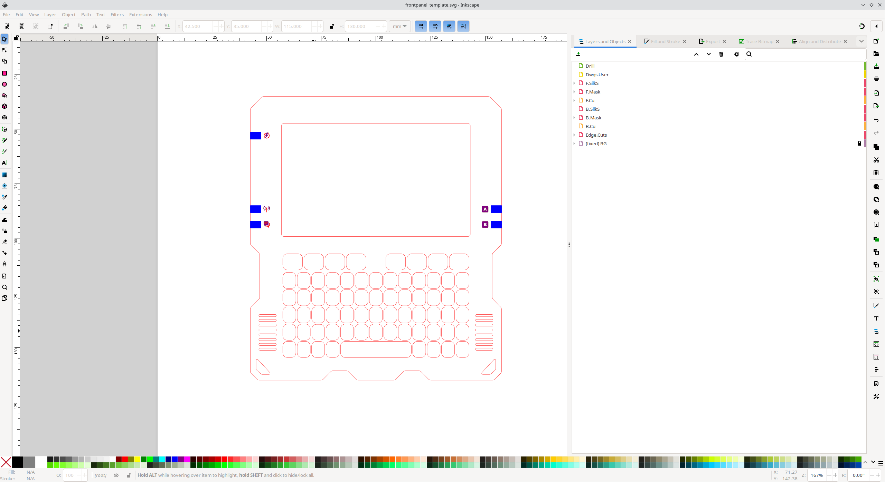
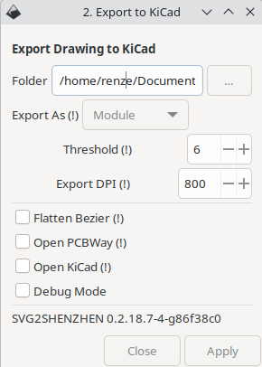

This page describes how to design and order a Konsool badge frontpanel.

## Designing a frontpanel using Inkscape, svg2shenzhen and KiCad

The first step of designing a frontpanel is creating artwork that can be converted into a KiCad footprint. For this [Inkscape](https://inkscape.org/) and the Inkscape plugin [svg2shenzhen](https://github.com/badgeek/svg2shenzhen) are used.

Of course it is also possible to use any other method which allows you to import a footprint into KiCad so if you're using a different method then you can skip ahead to the KiCad section.

Instructions on how to install svg2shenzhen can be found in the [readme](https://github.com/badgeek/svg2shenzhen?tab=readme-ov-file#install) of the repository.

After opening the design file in Inkscape you will notice that multiple layers are used. Each of the layers in the design corresponds with a KiCad layer, this allows you to define how a shape should appear on the circuit board.

The most important layers are:

 - Edge.Cuts: this is the outline of the board, the PCB manufacturer will use a CNC mill to cut the board following the edges of the object on this layer.
 - F.Cu and B.Cu: these layers define where to place copper on the front and back of the circuit board.
 - F.Mask and B.Mask: all shapes drawn on this layer are cut out of the colored soldermask layer of the board.
 - F.SilkS and B.SilkS: these layers are printed on the front and back silkscreen layer respectively. The silkscreen layer is a non-conductive layer of ink usually used to add reference designators and text to a circuit board.

{}
The mask layers are negative layers, the contents of the layer determine where NOT to place soldermask.
{}

{}
Silkscreen can only be placed on top of solder mask, silkscreen overlapping with any area defined in the mask layers will be removed by the board manufacturer. Keep in mind that KiCad will render the silkscreen in these locations but that this does not match the end result.
{}

{}
Round shapes are not correctly exported to KiCad on the Edge.Cuts layer. Workaround is adding a lot more nodes and preferably setting segments to be straight.
{}

Export the design to KiCad by navigating to `Extensions > Svg2Shenzhen > 2. Export to Kicad...`

## KiCad

...
