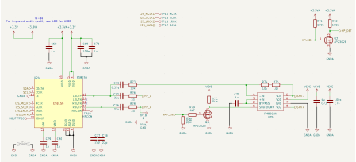

## Schematic

## ES8156 Pin table

| Pin | Name  | Net        | Direction     | Function                                            |
| --- | ----- | ---------- | ------------- | --------------------------------------------------- |
| 1   | CDATA | SDA        | Bidirectional | I²C Data                                            |
| 2   | CCLK  | SCL        | Input         | I²C Clock                                           |
| 3   | MCLK  | I2S_MCLK   | Input         | Master Clock                                        |
| 4   | DVDD  | 3v3        |               | Power supply for digital                            |
| 5   | PVDD  | 3v3        |               | Power supply for digital input and output           |
| 6   | DGND  | GND        |               | Ground                                              |
| 7   | SCLK  | I2C_SCLK   | Input         | I2C Clock Line                                      |
| 8   | SDIN  | I2S_DATA   | Input         | DAC Serial data input                               |
| 9   | LRCK  | I2S_LRCK   | Bidirectional | Serial data left and right channel frame clock      |
| 10  | NC    |            |               | Not in use                                          |
| 11  | ROUTP | HP_R       | Output        | Audio out right                                     |
| 12  | NC    |            |               | Not in use                                          |
| 13  | AGND  | GND        |               | Analog audio ground                                 |
| 14  | NC    |            |               | Not in use                                          |
| 15  | LOUTP | HP_L       | Output        | Audio out left                                      |
| 16  | AVDD  | 3v3        |               | Power from LDO                                      |
| 17  | VRP   |            |               | Filtering capacitor connection                      |
| 18  | VMID  |            |               | Filtering capacitor connection                      |
| 19  | CE    | GNDA       |               | Ground                                              |
