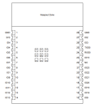

---
title ESP32C6 pinout
linkTitle ESP32 C6
nodateline true
weight -10
---

## ESP32 C6

| Name | No. | Type1 | Function                    |
| ---- | --- | ----- | --------------------------- |
| GND  | 1   | P     | Ground                      |
| 3V3  | 2   | P     | Power supply                |
| EN   | 3   | I     | Enable                      |
| IO4  | 4   | IOT   | MTMS, GPIO4, ADC1_CH4       |
| IO5  | 5   | IOT   | MTDI, GPIO5, ADC1_CH5       |
| IO6  | 6   | IOT   | MTCK, GPIO6, ADC1_CH6       |
| IO7  | 7   | IOT   | MTDO, GPIO7                 |
| IO0  | 8   | IOT   | GPIO0, XTAL_32K_P, ADC1_CH0 |
| IO1  | 9   | IOT   | GPIO1, XTAL_32K_N, ADC1_CH1 |
| IO8  | 10  | IOT   | GPIO8                       |
| IO10 | 11  | IOT   | GPIO10                      |
| IO11 | 12  | IOT   | GPIO11                      |
| IO12 | 13  | IOT   | GPIO12, USB_D+              |
| IO13 | 14  | IOT   | GPIO13, USB_D+              |
| IO9  | 15  | IOT   | GPIO9                       |
| IO18 | 16  | IOT   | GPIO18                      |
| IO19 | 17  | IOT   | GPIO19                      |
| IO20 | 18  | IOT   | GPIO20                      |
| IO21 | 19  | IOT   | GPIO21                      |
| IO22 | 20  | IOT   | GPIO22                      |
| IO23 | 21  | IOT   | GPIO23                      |
| NC   | 22  | —     | NC                          |
| IO15 | 23  | IOT   | GPIO15                      |
| RXD0 | 24  | IOT   | U0RXD, GPIO17               |
| TXD0 | 25  | IOT   | U0TXD, GPIO16               |
| IO3  | 26  | IOT   | GPIO3, ADC1_CH3             |
| IO2  | 27  | IOT   | GPIO2, ADC1_CH2             |
| GND  | 28  | P     | Ground                      |
| EPAD | 29  | P     | Ground                      |
