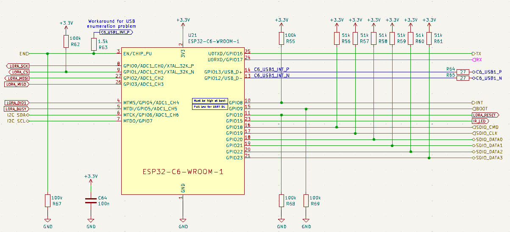

## Schematic

## ESP32 Pin table

| Pin | Name | Net        | Direction     | Function                                            |
| --- | ---- | ---------- | ------------- | --------------------------------------------------- |
| 1   | GND  | Power      |               |                                                     |
| 2   | 3V3  | Power      |               |                                                     |
| 3   | EN   | EN         | Input         | Enable signal from the CH32V203                     |
| 4   | IO4  | LORA_DIO1  | Input         | LoRa IRQ (Interrupt)                                |
| 5   | IO5  | LORA_BUSY  | Input         | LoRa Busy Signal                                    |
| 6   | IO6  | I2C_SDA    | Bidirectional | I2C Data Line                                       |
| 7   | IO7  | I2C_SCL    | Input         | I2C Clock Line                                      |
| 8   | IO0  | LORA_SCK   | Input         | LoRa SPI Clock                                      |
| 9   | IO1  | LORA_CS    | Output        | LoRa SPI Chip Select                                |
| 10  | IO8  | INT        | Output        | Interrupt line to ESP32-P4                          |
| 11  | IO10 | LORA_RESET | Output        | LoRa Reset                                          |
| 12  | GND  | Power      |               |                                                     |
| 13  | IO12 | C6_USB1_N  | Bidirectional | Via USB hub to USB-C port                           |
| 14  | IO13 | C6_USB1_P  | Bidirectional | Via USB hub to USB-C port                           |
| 15  | IO9  | BOOT       | Input         | BOOT mode select and VUSB (USB-A power) enable line |
| 16  | IO18 | SDIO_CMD   | Bidirectional | SDIO bus to P4 Command                              |
| 17  | IO19 | SDIO_CLK   | Output        | SDIO bus to P4 Clock                                |
| 18  | IO20 | SDIO_DATA0 | Bidirectional | SDIO bus to P4 Data Line 0                          |
| 19  | IO21 | SDIO_DATA1 | Bidirectional | SDIO bus to P4 Data Line 1                          |
| 20  | IO22 | SDIO_DATA2 | Bidirectional | SDIO bus to P4 Data Line 2                          |
| 21  | IO23 | SDIO_DATA3 | Bidirectional | SDIO bus to P4 Data Line 3                          |
| 22  | NC   |            |               |                                                     |
| 23  | IO15 | IR_LED     | Output        | Infrared LED Control                                |
| 24  | RXD0 | RX         | Input         | UART to P4 Receive                                  |
| 25  | TXD0 | TX         | Output        | UART to P4 Transmit                                 |
| 26  | IO3  | LORA_MISO  | Input         | LoRa SPI MISO                                       |
| 27  | IO2  | LORA_MOSI  | Output        | LoRa SPI MOSI                                       |
| 28  | GND  | Power      |               |                                                     |
| 29  | GND  | Power      |               |                                                     |
