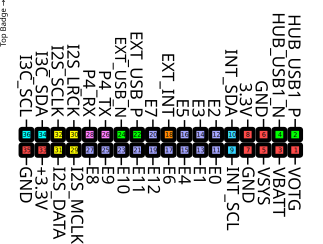

## Back Expansion layout

  

## Back expansion port

This port is not exposed by default, and a modified back cover needs to be used to make it accessible. For this reason the port is also named the "internal expansion port".

| Function     | Name       | GPIO | Description                                               | Notes                                                                                                                                                                        |
|--------------|------------|------|-----------------------------------------------------------|------------------------------------------------------------------------------------------------------------------------------------------------------------------------------|
| Power output | VOTG       | -    | Output from booster DC/DC converter in the PMIC           | 5 volt when booster is enabled, +/- VSYS when booster is disabled                                                                                                            |
| USB          | HUB_USB1_P | -    | Port on USB hub for USB-C port (DP)                       | Can be used to expose an USB device on the add-on to the PC plugged into the USB-C port                                                                                      |
| Power output | HUB_USB1_N | -    | Port on USB hub for USB-C port (DN)                       | Can be used to expose an USB device on the add-on to the PC plugged into the USB-C port                                                                                      |
| USB          | VBATT      | -    | Battery voltage (3.0 – 4.2v)                              | Directly connected to battery connector, always on even when the device is turned off                                                                                        |
| Power output | VSYS       | -    | System voltage (3.0 – 5.0v)                               | Switched power rail for powering the system, can be powered by battery or USB-C port, off when device is turned off                                                          |
| Power ref.   | GND        | -    | Voltage reference (ground)                                |                                                                                                                                                                              |
| Power ref.   | GND        | -    | Voltage reference (ground)                                |                                                                                                                                                                              |
| Power output | +3.3v      | -    | Main logic supply rail (3.3v)                             |                                                                                                                                                                              |
| I2C          | INT_SCL    |      | Internal I2C bus, shared with other I2C devices (SCL)     | Used to connect I2C devices and an EEPROM for add-on identification                                                                                                          |
| I2C          | INT_SDA    |      | Internal I2C bus, shared with other I2C devices (SDA)     | Used to connect I2C devices and an EEPROM for add-on identification                                                                                                          |
| GPIO         | E0         | 36   | GPIO                                                      |                                                                                                                                                                              |
| GPIO         | E1         | 0    | GPIO                                                      |                                                                                                                                                                              |
| GPIO         | E2         | 6    | GPIO, also connected to camera GPIO 1                     | Shared with camera connector                                                                                                                                                 |
| GPIO         | E3         | 46   | GPIO, VSDCARD LDO must be enabled to use this pin         | Connected via level shifter, externally these GPIOs operate at 3.3v but the GPIOs are powered by the VSDCARD power domain                                                    |
| GPIO         | E4         | 47   | GPIO, VSDCARD LDO must be enabled to use this pin         | Connected via level shifter, externally these GPIOs operate at 3.3v but the GPIOs are powered by the VSDCARD power domain                                                    |
| GPIO         | E5         | 48   | GPIO, VSDCARD LDO must be enabled to use this pin         | Connected via level shifter, externally these GPIOs operate at 3.3v but the GPIOs are powered by the VSDCARD power domain                                                    |
| GPIO         | E6         | 45   | GPIO, VSDCARD LDO must be enabled to use this pin         | Connected via level shifter, externally these GPIOs operate at 3.3v but the GPIOs are powered by the VSDCARD power domain                                                    |
| GPIO         | E7         | 7    | GPIO, in low power domain of P4, has 51k pull-up resistor | Can be used as wakeup pin to wake up the ESP32-P4 from deep sleep                                                                                                            |
| GPIO         | E8         | 54   | GPIO                                                      |                                                                                                                                                                              |
| GPIO         | E9         | 49   | GPIO                                                      |                                                                                                                                                                              |
| GPIO         | E10        | 53   | GPIO                                                      |                                                                                                                                                                              |
| GPIO         | EXT_USB_P  | 26   | Can be used as GPIO or as USB FS PHY (DP)                 | The USB PHYs of the P4 can be swapped between the  USB serial/jtag and user controlled USB peripheral. If badgelink is used then this PHY exposes the serial/jtag peripheral |
| GPIO         | E11        | 52   | GPIO                                                      |                                                                                                                                                                              |
| GPIO         | EXT_USB_N  | 27   | Can be used as GPIO or as USB FS PHY (DN)                 | The USB PHYs of the P4 can be swapped between the  USB serial/jtag and user controlled USB peripheral. If badgelink is used then this PHY exposes the serial/jtag peripheral |
| GPIO         | E12        | 51   | GPIO                                                      |                                                                                                                                                                              |
| GPIO         | P4_TX      | 37   | Exposes boot console of P4, can be used as GPIO           | Must be low during boot                                                                                                                                                      |
| GPIO         | E13        | 50   | GPIO                                                      |                                                                                                                                                                              |
| GPIO         | P4_RX      | 38   | Exposes boot console of P4, can be used as GPIO           | Must be high during boot                                                                                                                                                     |
| I2S          | I2S_MCLK   |      | Digital audio bus master clock                            | Reference clock for connected I2S devices                                                                                                                                    |
| I2S          | I2S_LRCK   |      | Digital audio bus word clock                              | Word clock (left-right selection) for connected I2S devices                                                                                                                  |
| I2S          | I2S_DATA   |      | Digital audio bus data output                             | Data output from mainboard for connected I2S DACs                                                                                                                            |
| I2S          | I2S_SCLK   |      | Digital audio bus sample clock                            | Sample clock for connected I2S devices                                                                                                                                       |
| Power output | +3.3v      | -    | Main logic supply rail (3.3v)                             |                                                                                                                                                                              |
| I3C          | I3C_SDA    |      | I3C bus, shared with QWIIC connector (SDA)                | Can also be used as I2C bus                                                                                                                                                  |
| Power ref.   | GND        | -    | Voltage reference (ground)                                |                                                                                                                                                                              |
| I3C          | I3C_SCL    |      | I3C bus, shared with QWIIC connector (SCL)                | Can also be used as I2C bus                                                                                                                                                  |

## Limitations & warnings

- Total for all 3.3v outputs **must not exceed 1A** of current. It is generally adviced to stay well below this figure.
- Do **not** exceed a current of 1.5A from the battery when the battery is connected to the internal battery connector
- Do **not** charge the battery via the internal add-on port
