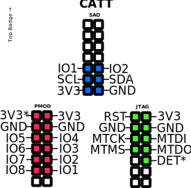
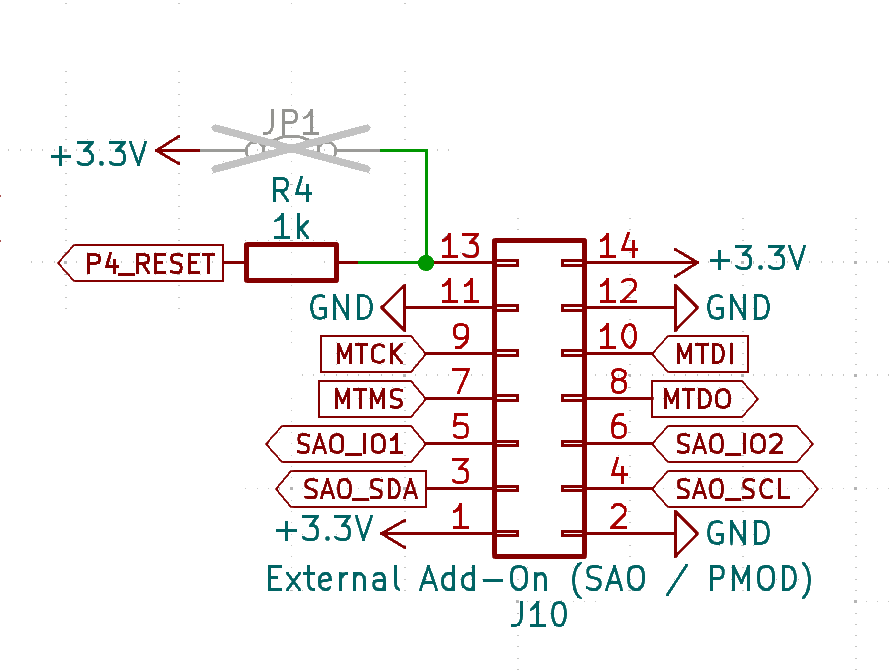

## Description

The CATT connector combines several different connectors in one.

- Special Addon (SAO)
- JTAG
- PMOD

Because of this multi functional nature, the name for the connector is CATT (Connect all the things), even though there are more kind of things to connect.

## SAO

  

- *DET: Detect, when pulled down during power up, JTAG functionality is provided
- *3V3: Not connected by default, jumper on the PCB needs to be closed to supply 3V3

## Schematic

