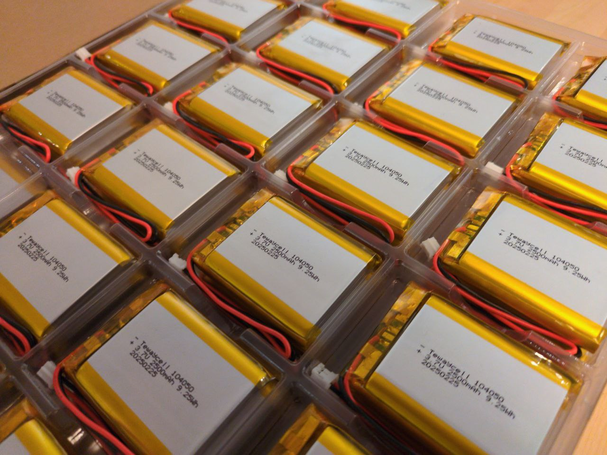

# Battery

## Specifications

| label    | Value             |
| -------- | ----------------- |
| Brand    | Tewaycell         |
| Type     | Lithium ion       |
| Voltage  | 3.7V              |
| Capacity | 2500 mAH (9.25Wh) |
