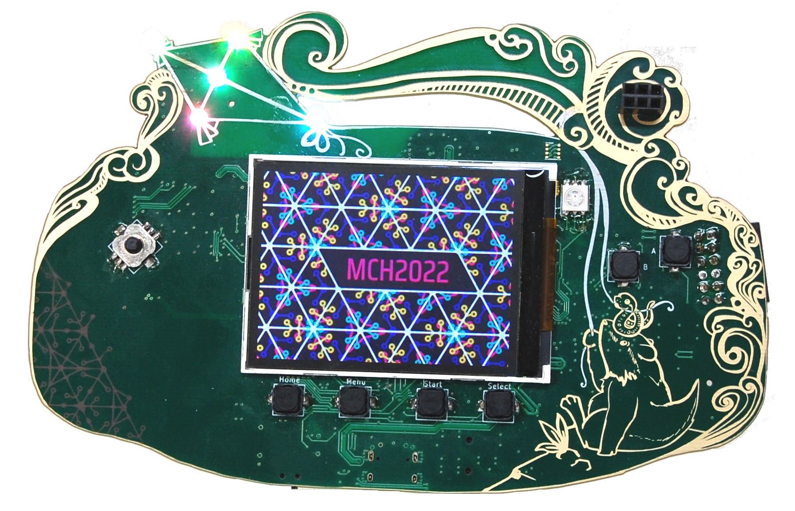
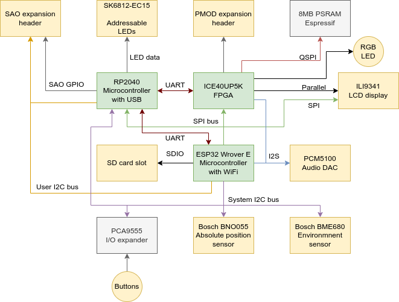

The MCH2022 badge is our most advanced badge yet. Shaped like a game console this badge is a powerhouse filled with cool technology.

# The hardware

The badge contains an Espressif ESP32 Wrover-e WiFi module with 16MB of flash storage and 8MB of PSRAM, an Raspberry pi RP2040 microcontroller chip for advanced USB communication and board management and a Lattice ICE40UP5K FPGA for hardware accelerated graphics.

## Block diagram

The badge contains a huge amount of awesome chips, so many that a block diagram is necessary to explain how everything is interconnected.

The ESP32 is at the center of the operation. It has access to almost all the peripherals on the badge and using it's WiFi connectivity it can load new firmware and applications from the internet.

The RP2040 microcontroller provides USB connectivity consisting of two serial ports (for the ESP32 and the FPGA), WebUSB for managing the badge using your browser and HID for acting like a keyboard, mouse or joystick. It also drives the SK6812-EC15 addressable LEDs, giving the badge a lot of bling and eyecandy. To top it off a lot of the I/O pins of the RP2040 have been broken out, both as the IO pins of the SAO connector and as testpads next to the prototyping areas on the back of the badge.

The ICE40UP5K FPGA is programmed over an SPI connection by the ESP32. Using this connection the FPGA can also communicate with the application running on the ESP32. Our goal is to enable people to learn about HDL programming so new bitstreams can easily be loaded into the FPGA by user applications, to provide any function you want ranging from a simple LED blinker to a RISC-V SoC. To accomodate more advanced designs the FPGA is connected to the LCD display via a parallel bus, enabling it to update the display at high refresh rates, as well as 8MB of PSRAM via a Quad-SPI bus. 8 of the I/O pins of the FPGA have been broken out as an industry standard PMOD header, allowing users to connect standard expansion modules or their own creations.

# The software

When powered on the ESP32 will load an application chooser menu, from where the user can boot into the preinstalled applications such as a Micropython scripting environment, a sensor playground for the Bosch sensors, sponsor provided apps and of course the applications the user downloads from the Hatchery, our badge application repository.

The software is still in active development, more information will be published here soon.
