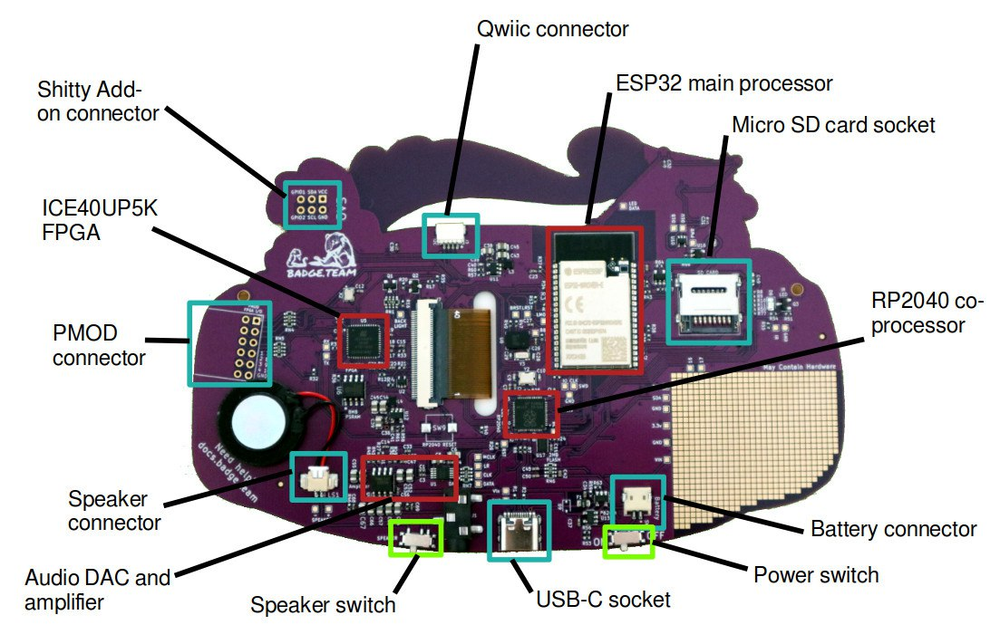
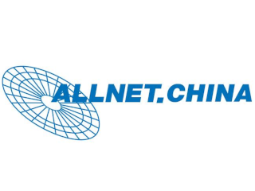
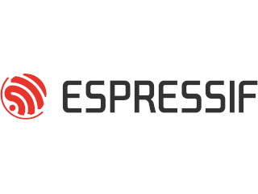
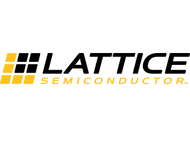
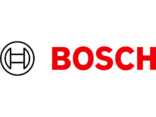
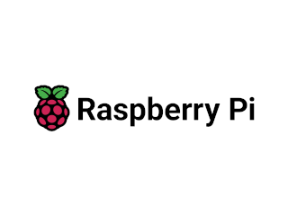

The MCH2022 badge is our most advanced badge yet. Shaped like a game console
this badge is a powerhouse filled with cool technology. 

Once assembled, you can use the badge to display your name, write Python
code and maybe play a game or find an Easter Egg, but don't forget: the
real fun starts when you [hack it](software-development) to make it your own!

# Getting Started

We've assembled some resources to [quickly get
started](./getting-started).

# Getting Help (and helping ...)

Reread the instructions if something isn't working. Then go to our
[**Troubleshooting Guide**](support/troubleshooting_faq)

Check out [these resources](./support) if you run into trouble.

# Case and frontpanel

You can find a 3D printable case and a lasercuttable frontpanel in this [GIT repository](https://github.com/badgeteam/mch2022-housing/tree/master).

# The Hardware

The badge contains an Espressif ESP32 Wrover-e WiFi module with 16MB of
flash storage and 8MB of PSRAM, an Raspberry Pi RP2040 microcontroller
chip for advanced USB communication and board management and a Lattice
ICE40UP5K FPGA for hardware accelerated graphics.

It also contains a bunch of stuff (TODO elaborate "stuff").

The hardware is described in more detail in the [hardware section](./hardware).

# The Software

The ESP32 loads an [application chooser](getting-started/software) menu when you first power it on.
Once loaded, you can launch a number of preinstalled applications: 

- the Name-Tag app
- a Micropython scripting environment
- a sensor playground for the Bosch sensors
- [The Hatchery](getting-started/hatchery) where you can load more apps!
 
and the app contains a link to the Hatchery an app store you can use to
load more apps. And more importantly, where you can publish app you
[write yourself](software-development). 

The software is still in active development, more information will be
published here soon.

# Hardware sponsors

  
  
  
  
  
  &emsp;&emsp;&emsp;&emsp;&emsp;&emsp;&emsp;&emsp;&emsp;&emsp;

* **ALLNET China** was our production partner, for which we are more than grateful. They took care of sourcing most components and oversaw the production process [in China][ALLNET China], saving us a lot of work and potential headaches and allowing us to focus on the product!
* **Espressif** was very generous to donate us all of the [ESP32-WROVER-E][ESP32] modules we needed. The ESP32 has proven itself to be a solid basis for badges in the past, and for related projects such as the [PocketSprite]. Espressifs continued support means a lot to us as it allows us to continue expanding our existing ESP32-based ecosystem!
* **Lattice Semiconductor** provided us with 4000 pieces of their awesome [ICE40UP5K] low-power FPGA. With this donation, they enabled us to explore and provide a new dimension of hardware capabilities and user-created applications. We shipped the first FPGA-equipped event badge in the world. Thanks Lattice!
* **Bosch Sensortec** let us put two of their advanced sensors on the badge: the [BNO055] 9-axis Absolute Orientation Sensor, and their new [BME680] Air-Quality (And More) Sensor. These sensors enable a range of uses for the badge off-the-shelf, allowing developers to develop more engaging games and expanding the range of potential uses for the badge after the event.
* The **Raspberry Pi Foundation** helped us out with a discount when another chip which we tried to source became unavailable. On the badge, the [RP2040] enables a wide range of USB capabilities, allowing us to work on [bridging the gap][Badge IDE] between embedded development and everyday computing.

All of our sponsors helped us out in a time when sourcing capable chips was a near-impossible task. Without them, this project would not have been possible. We are grateful to all of them for their help and sponsorship, and we hope to work with them again in future badge projects!

[ALLNET China]: https://www.allnet.de/en/allnet-brand/unternehmen/weltweit/
[ESP32]: https://www.espressif.com/en/products/modules/esp32
[PocketSprite]: https://pocketsprite.com
[ICE40UP5K]: https://www.latticesemi.com/en/Products/FPGAandCPLD/iCE40UltraPlus
[BNO055]: https://www.bosch-sensortec.com/products/smart-sensors/bno055/
[BME680]: https://www.bosch-sensortec.com/products/environmental-sensors/gas-sensors/bme680/
[RP2040]: https://www.raspberrypi.com/products/rp2040/
[Badge IDE]: https://github.com/badgeteam/mch2022-webusb-site

## The team

The MCH2022 badge would not have been possible without the help of these amazing volunteers.

### Teamlead

 - Reinier van der Leer

### [Hardware](https://github.com/badgeteam/mch2022-badge-hardware)

 - [Renze Nicolai](https://nicolaielectronics.nl): Circuit diagram and PCB routing
 - [Nikolett S.](https://ankhaneko.art): Artwork

With the help of Anne Jan Brouwer, Kliment Yanev, Kuristian, Martin Ling, Paul Honig, Sylvain Munaut, Tom Clement, Fuchsia (f0x) and Sander de Haan.

### [Launcher firmware](https://github.com/badgeteam/mch2022-firmware-esp32)

 - [Renze Nicolai](https://nicolaielectronics.nl)
 - [Julian Scheffers (Robotman2412)](https://robot.scheffers.net/)
 - Sylvain "tnt" Munaut
 - Frans Faase
 - Joris W. (jorisplusplus)
 - Reinier van der Leer (Pwuts)
 - [Jeroen Domburg (spritetm)](https://spritesmods.com)
 - Arnold (Alt4arnold)
 - Pepijn de Vos
 - Andrejs Bondarevs (abondarevs)

### [FPGA examples and tools](https://github.com/badgeteam/mch2022-firmware-ice40)

 - Sylvain "tnt" Munaut
 - Matthias Koch [Mecrisp](http://mecrisp.sourceforge.net/)
 - Frans Faase
 - Carlos Venegas [@cavearr](https://twitter.com/cavearr)
 - Sylvain Lefebvre [@sylefeb](https://twitter.com/sylefeb)

### [BadgePython](https://github.com/badgeteam/badgePython/)

 - Joris W. (jorisplusplus)
 - [Renze Nicolai](https://nicolaielectronics.nl)
 - Tom Clement
 - Sylvain "tnt" Munaut
 - Jorai Rijsdijk (Erackron)
 - Pepijn de Vos
 - [Julian Scheffers (Robotman2412)](https://robot.scheffers.net/)

### [RP2040 co-processor firmware](https://github.com/badgeteam/mch2022-firmware-rp2040)

 - [Renze Nicolai](https://nicolaielectronics.nl)
 - Sylvain "tnt" Munaut
 - Reinier van der Leer (Pwuts)
 - Jana Marie Hemsing

### [Documentation](https://github.com/badgeteam/website)

 - Tim Becker (a2800276)
 - Matthias Koch (Mecrisp)
 - Pepijn de Vos
 - [Julian Scheffers (Robotman2412)](https://robot.scheffers.net/)
 - Sylvain "tnt" Munaut
 - TheRealProcyon
 - Pieter Vander Vennet
 - Jenny List
 - Oskar Roesler (bionade24)
 - Dominik (dloidolt)
 - Manuel Dipolt (xeniter)
 - p2mate
 - Sietse Ringers
 - Yvo de Haas
 - Marble (cyber-murmel)
