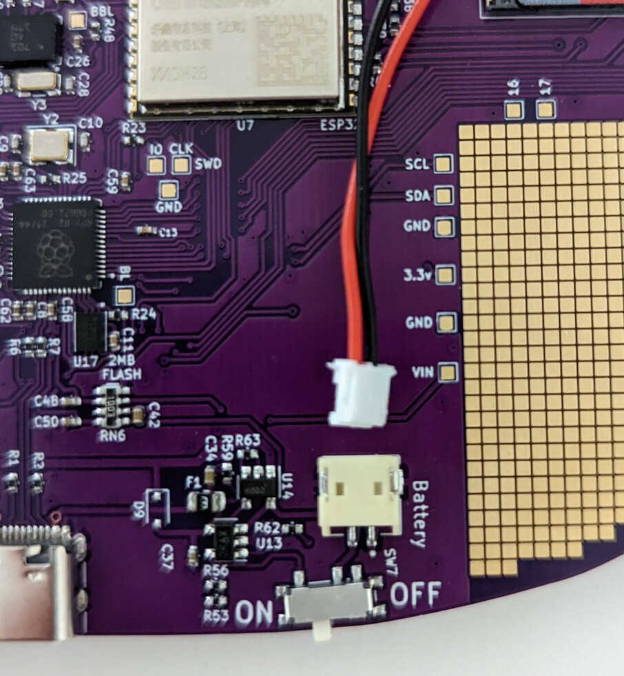

Congratulations, you're the proud owner of a shiny new MCH badge! It's a
fully-functional computer, and while you (can do stuff with it) out of the box,
the real fun starts when you start hacking it. The badge has two processors, an
FPGA and a ton of sensors and toys to play with all in the palm of your hand! And
we've done what we could to make using it as friendly and intuitive as
possible. We had a lot of fun making it, and we hope you'll have a lot of fun
using it.

# No fluff! I wanna get started!

Hook up the battery to the badge, the connector only allows it to be connected
the right way around. Set the labeled on/off switch to ON. Things should
quickly start up, display works and it makes a sound.

If this is the case everything works and you're good to go. Attach the battery
to the badge using the included velcro, slap on the lanyard (and possibly [insert an SD-Card](sdcard/)) and [Start
Hacking](../software-development)!

The rest of this page contains more detailed instructions in case you run into
problems.

# In the pack

If you are reading this at MCH, you received the unassembled badge in a
bag when you entered the camp.  Inside the bag are the following items:

(These will obviously change subject to what is in the pack)

- The badge itself
- A lithium-polymer battery for the badge
- A self-adhesive Velcro patch for attaching the battery
- A printed badge lanyard
- A leaflet containing basic information about the badge

## Fitting the battery

The battery is a silver pouch with a short cable terminated in a
trailing socket connector. This mates with a PCB mounted plug  which
you'll find on the component side of the badge. Place your badge screen
side down with the USB-C connector facing towards you, and you'll find
the on-board battery connector at the bottom right next to a field of gold
squares (the prototyping area -> link to hardware).

The trailing plug on the battery has a small lug on one side that
interfaces with a notch in the on-board socket. With the lug facing
upwards, carefully slot the two connectors together.

Now turn the badge on. The switch is labeled ON OFF and located just
below the battery connector. It will boot up, the display will start
displaying things and the speaker will make some noise.

The battery should now be attached to the badge via the connector. We've
provided velcro so you can affix it to the badge more firmly. One side
of the battery tends to buldge, so try out which side lies most snugly
against the badge. Find a good spot on the back of the battery and the
reverse of the badge to attach the velcro.

### Inserting an SD-Card

The SD-Card holder is a bit fiddly. We've assembled an [illustrated guide](sdcard/) to
inserting an SD-Card.

## Now what?

You should now have a working badge. We strongly suggest
that you hook it up to a live USB power source to fully charge the
battery. You'll need a cable with a USB-C at the badge end. 

While the battery is charging, it's time to explore the badge a little.
When you turn it on it will start with a splash screen and details of
all the sponsors who have made the event and the badge possible. You'll
then see the badge menu screen, so now's a goo time to move along to the
next step in this introduction: [using the MCH 2022 badge](./software). 

