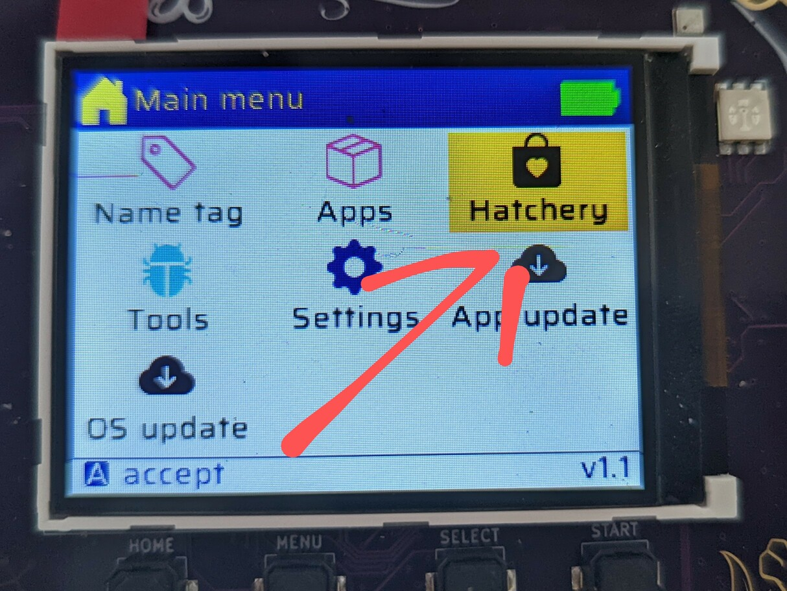

# WTF is a Hatchery!?

The Hatchery is an app store for The Badge!  

You can also sort through the apps other people have published there.  If you
do so, please be aware that we don't check for malware and will NEVER ask for
your credit card number or home banking password (just kidding, off course we
will.)

BTW, it's called Hatchery because it (used to) contain "eggs" because
previously the Hatchery was limited to Micropython apps and those are called
eggs. And eggs hatch if you don't eat them. Nowadays the Hatchery also supports
native ESP Apps and FPGA bitstreams.

You can also use the Hatchery to [publish your own
apps](../../software-development/hatchery) and share them with friends.  And
unlike other App Stores, you don't need a Dunn & Bradstreet Number, $1000 and
don't have to worry about your app being rejected because it contains malware.

## A Word of Warning

Our crack team of Useability Experts are working around the clock to make the
Hatchery even more intuitive and easy! So some of the information here,
especially the screenshots may be out of date by the time you read this. Also,
the documentation team is exceptionally lazy. Did we mention you can help
update the documentation!? Go to the [`website`
project](https://github.com/badgeteam/website) to create a Pull Request! 

Better yet, check out the repo for [The
Hatchery](https://github.com/badgeteam/hatchery) itself and make improvements.

## Find an App

This will probably be the challenging part. We recommend you do this on a big computer, like a laptop. Something with a keyboard.

Go to [mch20222.badge.team](http://mch2022.badge.team) and sift through our
fine offering of Hello World apps and super slow bitcoin miner malware.

If you go to the apps details page, you can download the app.
But you don't need to. Just remember the Category.

Now, go to the Hatchery app on the Badge.

Next you'll be asked whether you want to install an ESP32 app, a Python egg or
and FPGA bitstream. At the moment you kindof need to guess, here's a heuristic:

If the details page contains:

- a file named `main.bin` it's ESP32
- a bunch of Python files, it may be Python
- a file named `bitstream.bin` it's an FPGA bitstream

In the next step, go to the Category remembered. Let's pick "Safe Credit Card
Detail Storage" (ESP->Utility). That sounds totally legit! Select it with the
`A` button and you will see app details. As you can see, the app is, in fact,
totally legit.

Now just press `A` to install. It will download for a while.
Once it's done, go to the "Apps" menu and your brand new app should be
available to launch! Or ... uninstall.

