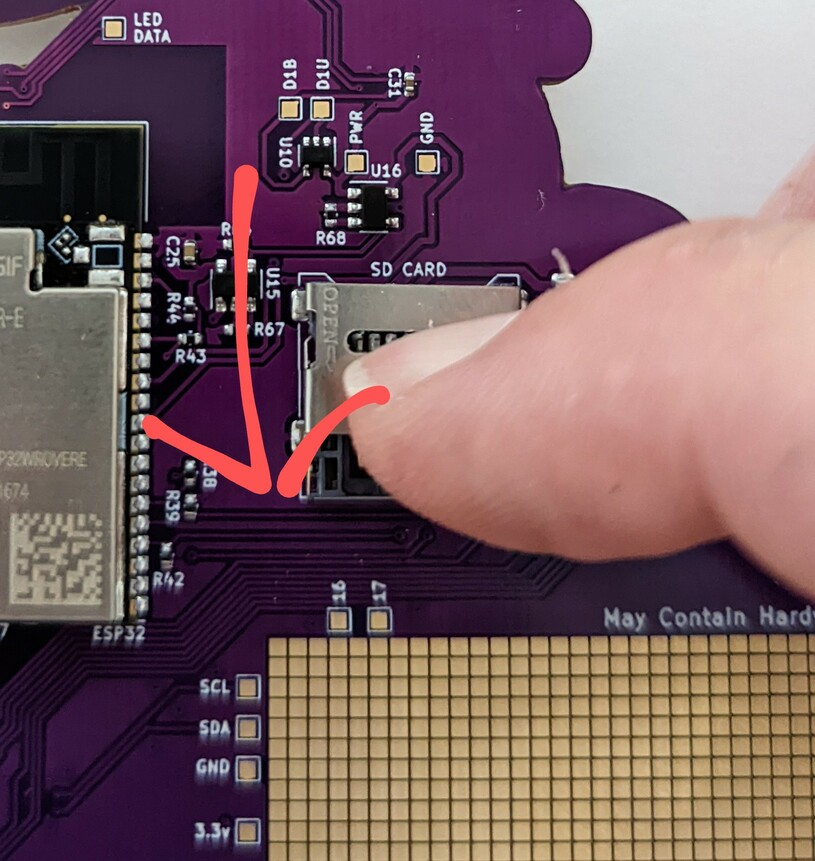
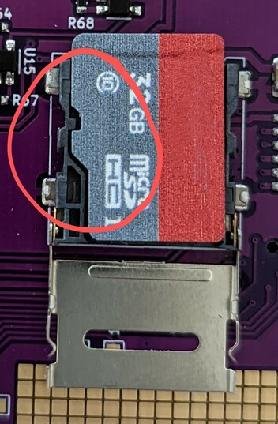
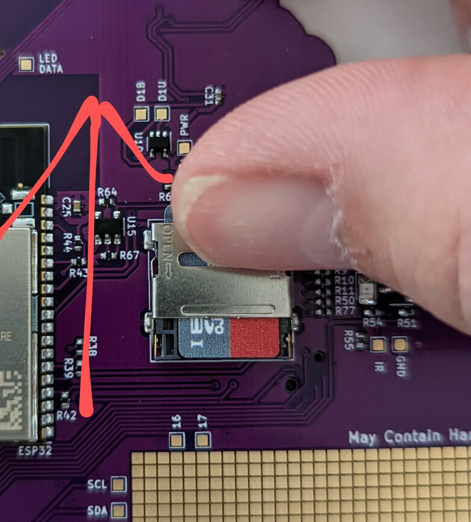

# I inserted the card correctly, but it doesn't work.

Format the card as `FAT32` *not* `exFAT`, please. And if you are using a
humongous 12TB Super SD Card, maybe try a cheap, small one from the grocery
store :)

# Oh Noes! I broke off the little metal thingie of the SD Card holder!

Oh well, better luck next time! Don't feel bad, you're not alone.

You can probably stick it back into the little grey plastic thingie.

# I almost broke off the little metal thingie of the SD Card holder, WTF!?

Lucky you! You've come to the right place.

The trick is to:

- insert a fingernail into the SD-Cardholder manipulation slot and pull DOWN!
  (DOWN is in the direction of the arrow in the picture.) 

- Somehow I never realized the metal thingie actually has "OPEN->" embossed in it
  until I uploaded the picture for the documenation. Don't I feel stupid ...

- fiddle around with your SD-Card to somehow get the alignment slot of the grey
  plastic thingie to align with the alignment notch in the card. 

- find a small-fingered nerd to hold the SD-Card in place while you flip the
  metal fastener over the card and insert a fingernail into the SD-Cardholder
  manipulation slot and push UP! (UP is the direction of the arrow in the
  picture)

