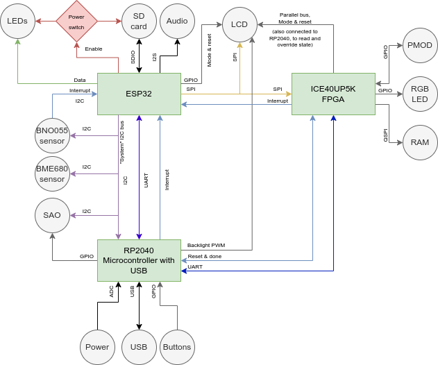

# Block diagram

The badge contains a huge amount of awesome chips, so many that a block
diagram is necessary to explain how everything is interconnected.

The ESP32 is at the center of the operation. It has access to almost all
the peripherals on the badge and using its WiFi connectivity it can
load new firmware and applications from the internet.

The RP2040 microcontroller provides USB connectivity consisting of two
serial ports (for the ESP32 and the FPGA), WebUSB for managing the badge
using your browser and HID for acting like a keyboard, mouse or
joystick. It also drives the SK6812-EC15 addressable LEDs, giving the
badge a lot of bling and eyecandy. To top it off a lot of the I/O pins
of the RP2040 have been broken out, both as the IO pins of the [SAO](https://hackaday.com/2019/03/20/introducing-the-shitty-add-on-v1-69bis-standard/)
connector and as testpads next to the prototyping areas on the back of
the badge.

The ICE40UP5K FPGA is programmed over an SPI connection by the ESP32.
Using this connection the FPGA can also communicate with the application
running on the ESP32. Our goal is to enable people to learn about HDL
programming so new bitstreams can easily be loaded into the FPGA by user
applications, to provide any function you want ranging from a simple LED
blinker to a RISC-V SoC. To accomodate more advanced designs the FPGA is
connected to the LCD display via a parallel bus, enabling it to update
the display at high refresh rates, as well as 8MB of PSRAM via a
Quad-SPI bus. 8 of the I/O pins of the FPGA have been broken out as an
industry standard PMOD header, allowing users to connect standard
expansion modules or their own creations.

# Resources

- An [overview](./pinout) of the how all the wonderful toyes are connected to each other.
- The [board schematics download](https://github.com/badgeteam/mch2022-badge-hardware/raw/master/schematic.pdf) or view [online](https://github.com/badgeteam/mch2022-badge-hardware/blob/master/schematic.pdf) at github
- 

## Datasheets and Resources
- [ESP32 datasheet](https://www.espressif.com/sites/default/files/documentation/esp32_datasheet_en.pdf) the datasheet for the main processor
- [ESP32 technical reference](https://www.espressif.com/sites/default/files/documentation/esp32_technical_reference_manual_en.pdf) technical reference for the main processor. This contains information about the features of the chip, so technically, it belongs in the firmware section, but ... whatever.
- [WROVER datasheet](https://www.espressif.com/sites/default/files/documentation/esp32-wrover-e_esp32-wrover-ie_datasheet_en.pdf) datasheet of the module. The processor is packed together with peripherals necessary for operations in a module (WROVER) nuder a metallic can.
- RP2040 [documentation site](https://www.raspberrypi.com/documentation/microcontrollers/rp2040.html) and [datasheet](https://datasheets.raspberrypi.com/rp2040/rp2040-datasheet.pdf)
- Lattice ICE40UP5K - iCE40UltraPlus [documentation site](https://www.latticesemi.com/en/Products/FPGAandCPLD/iCE40UltraPlus) and [datasheet](https://www.latticesemi.com/view_document?document_id=51968) 
- [BME680](https://www.bosch-sensortec.com/media/boschsensortec/downloads/datasheets/bst-bme680-ds001.pdf) 4 in 1 gas sensor. (temperature, humidity, air pressure and volatile organic compounds (VOC) 
- [BNO055](https://www.bosch-sensortec.com/media/boschsensortec/downloads/datasheets/bst-bno055-ds000.pdf) accelerometer, gyroscope, magnetometer sensor
- [Display](https://raw.githubusercontent.com/badgeteam/mch2022-badge-hardware/prototype/second/datasheets/Z240IT008%E8%A7%84%E6%A0%BC%E4%B9%A6%20v0.1.pdf) also have a look [here](https://cdn-shop.adafruit.com/datasheets/ILI9341.pdf) 
- [SK6812-EC15](https://cdn-shop.adafruit.com/product-files/1138/SK6812+LED+datasheet+.pdf) addressable RGB - LEDs (aka Neopixel)
