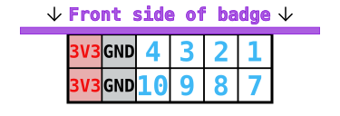

## Connectors

### SAO (Shitty AddOn)

Addon connector following the [SHITTY ADD-ON V1.69BIS standard](https://hackaday.com/2019/03/20/introducing-the-shitty-add-on-v1-69bis-standard/).

| Pin | Description | Direction    | Connection                                       |
|-----|-------------|--------------|--------------------------------------------------|
| 1   | VCC         | Power output | 3.3v supply voltage output                       |
| 2   | GND         | Power output | Ground reference                                 |
| 3   | SDA         | Data IO      | I2C bus data                                     |
| 4   | SCL         | Data output  | I2C bus clock                                    |
| 5   | GPIO1       | Data IO      | User configurable IO, connected to RP2040 GPIO18 |
| 6   | GPIO2       | Data IO      | User configurable IO, connected to RP2040 GPIO19 |

### PMOD (peripheral module interface)

The PMOD connector is wired up to the iCE40 FPGA. Note that while the connector is physically located on the backside of the badge, it has been wired up such that the PMOD's top side must be pointed in the same direction as the badge's top.

| PMOD pin | ICE40 pin | Note                                               |
|----------|-----------|----------------------------------------------------|
| 1        | 47        | `IOB_2a`    (paired with PMOD pin 7 `IOB_3b_G6`)   |
| 2        | 48        | `IOB_4a`    (paired with PMOD pin 8 `IOB_5b`)      |
| 3        | 4         | `IOB_8a`    (paired with PMOD pin 9 `IOB_9b`)      |
| 4        | 2         | `IOB_6a`                                           |
| 7        | 44        | `IOB_3b_G6` (paired with PMOD pin 1 `IOB_2a`)      |
| 8        | 45        | `IOB_5b`    (paired with PMOD pin 2 `IOB_4a`)      |
| 9        | 3         | `IOB_9b`    (paired with PMOD pin 3 `IOB_8a`)      |
| 10       | 46        | `IOB_0a`                                           |

## Chips

### ESP32

| ESP32 GPIO     | Direction                             | Function                                             | Note                                                                                          |
|----------------|---------------------------------------|------------------------------------------------------|-----------------------------------------------------------------------------------------------|
| 0              | Both                                  | I2S master clock output / UART download select input | Drives I2S DAC / driven by RP2040 through resistor                                            |
| 1              | Output                                | UART TX                                              | Connected to RP2040                                                                           |
| 2              | Both                                  | SD card data 0                                       | SD card slot                                                                                  |
| 3              | Input                                 | UART RX                                              | Connected to RP2040                                                                           |
| 4              | Output                                | I2S channel select (LR)                              |                                                                                               |
| 5              | Output                                | LED data                                             | Connected to the SK6805 LEDs in the kite                                                      |
| 12             | Output                                | I2S clock                                            |                                                                                               |
| 13             | Output                                | I2S data                                             |                                                                                               |
| 14             | Output                                | SD clock                                             | SD card slot                                                                                  |
| 15             | Output                                | SD command                                           | SD card slot                                                                                  |
| 18             | Output                                | SPI clock                                            | Connected to LCD and FPGA                                                                     |
| 19             | Output                                | SD card and kite LED power control                   | Set high to enable power to LEDs and SD card                                                  |
| 21             | Output                                | I2C clock                                            | Connected to RP2040, BNO055, BME680, Qwiic connector and SAO addon connector                  |
| 22             | Both                                  | I2C data                                             | Connected to RP2040, BNO055, BME680, Qwiic connector and SAO addon connector                  |
| 23             | Output                                | SPI MOSI                                             | Data from ESP32 to LCD / FPGA                                                                 |
| 25             | Both                                  | LCD reset                                            | Set to output low to reset LCD, leave floating normally                                       |
| 26             | Output                                | LCD mode                                             | Low: LCD in SPI mode, high: LCD in parallel mode                                              |
| 27             | Output                                | SPI chip select for ICE40                            | Low: select ICE40, high: deselect ICE40                                                       |
| 32             | Both                                  | SPI chip select for LCD                              | Low: select LCD, high: deselect LCD. Note: output in LCD SPI mode, input in LCD parallel mode |
| 33             | Both                                  | LCD DC (data or command) selection                   | Note: output in LCD SPI mode, input in LCD parallel mode                                      |
| 34             | Input                                 | Interrupt from RP2040                                |                                                                                               |
| 35             | Input                                 | SPI MISO                                             | Connected to ICE40                                                                            |
| 36 (SENSOR_VP) | Input                                 | Interrupt from position sensor (BNO055)              |                                                                                               |
| 39 (SENSOR_VN) | Input                                 | Interrupt from ICE40 FPGA                            |                                                                                               |

### RP2040

| RP2040 GPIO | Direction | Pull | Function | Description                            |
|-------------|-----------|------|----------|----------------------------------------|
| 0           | Output    |      | UART0 TX | ESP32 UART                             |
| 1           | Input     |      | UART0 RX | ESP32 UART                             |
| 2           | Both      |      | I2C1 SDA | I2C bus data (RP2040 is in slave mode) |
| 3           | Input     |      | I2C1 SCL | I2C bus clock                          |
| 4           | Input     | Up   | GPIO     | Button: MENU                           |
| 5           | Input     | Up   | GPIO     | Button: HOME                           |
| 6           | Input     | Up   | GPIO     | Button: ACCEPT                         |
| 7           | Input     | Up   | GPIO     | Button: Joystick A                     |
| 8           | Input     | Up   | GPIO     | Button: Joystick B                     |
| 9           | Input     | Up   | GPIO     | Button: Joystick C                     |
| 10          | Input     | Up   | GPIO     | Button: Joystick D                     |
| 11          | Input     | Up   | GPIO     | Button: Joystick E                     |
| 12          | Both      |      | GPIO     | ESP32 bootloader mode¹                 |
| 13          | Output    |      | GPIO     | ESP32 enable                           |
| 14          | Both      |      | GPIO     | ESP32 interrupt¹                       |
| 15          | Output    |      | PWM      | LCD backlight brightness               |
| 16          | Both      |      | GPIO     | Available next to prototyping area     |
| 17          | Both      |      | GPIO     | Available next to prototyping area     |
| 18          | Both      |      | GPIO     | SAO GPIO1                              |
| 19          | Both      |      | GPIO     | SAO GPIO2                              |
| 20          | Input     |      | GPIO     | FPGA done                              |
| 21          | Output    |      | GPIO     | FPGA reset                             |
| 22          | Input     | Up   | GPIO     | Button: START                          |
| 23          | Input     |      | GPIO     | LiPo charger state                     |
| 24          | Output    |      | UART1 TX | FPGA UART                              |
| 25          | Input     |      | UART1 RX | FPGA UART                              |
| 26          | Input     | Up   | GPIO     | Button: BACK                           |
| 27          | Output    |      | GPIO     | Infrared LED                           |
| 28          | Input     |      | ADC      | Voltage measurement: USB input         |
| 29          | Input     |      | ADC      | Voltage measurement: Battery           |

¹: Set to input normally and force low to activate

# ICE40 FPGA

| ICE40 pin | ICE40 GPIO        | Direction | Description         | Notes
|-----------|-------------------|-----------|---------------------|-------
| 2         | `IOB_6a`          | Both      | PMOD pin 4          |
| 3         | `IOB_8a`          | Both      | PMOD pin 3          |
| 4         | `IOB_9b`          | Both      | PMOD pin 9          |
| 6         | `IOB_13b`         | Input     | UART RX             |
| 9         | `IOB_16a`         | Output    | UART TX             |
| 10        | `IOB_18a`         | Output    | Interrupt           | Active-low
| 11        | `IOB_20a`         | Output    | LCD register select |
| 12        | `IOB_22b`         | Both      | RAM SPI D2          |
| 13        | `IOB_24a`         | Both      | RAM SPI D1          |
| 14        | `IOB_32a_SPI_SO`  | Output    | SPI MISO            |
| 15        | `IOB_34b_SPI_SCK` | Input     | SPI SCK             |
| 16        | `IOB_35b_SPI_SS`  | Input     | SPI SS              |
| 17        | `IOB_33b_SPI_SI`  | Input     | SPI MOSI            |
| 18        | `IOB_31b`         | Output    | RAM SPI CS          |
| 19        | `IOB_29b`         | Output    | RAM SPI SCK         |
| 20        | `IOB_25b_G3`      | Both      | RAM SPI D3          |
| 21        | `IOB_23b`         | Both      | RAM SPI D0          |
| 23        | `IOT_37a`         | Output    | LCD write           |
| 25        | `IOT_36b`         | Input     | LCD frame sync      |
| 26        | `IOT_39a`         | Output    | LCD data 0          |
| 27        | `IOT_38a`         | Output    | LCD data 1          |
| 28        | `IOT_41a`         | Output    | LCD CS              |
| 31        | `IOT_42b`         | Output    | LCD data 2          |
| 32        | `IOT_43a`         | Output    | LCD data 3          |
| 34        | `IOT_44b`         | Output    | LCD data 4          |
| 35        | `IOT_46b_G0`      | Input     | 12MHz clock         |
| 36        | `IOT_48b`         | Output    | LCD reset           | Active-low, drive open-drain
| 37        | `IOT_45a_G1`      | Output    | LCD data 5          |
| 38        | `IOT_50b`         | Output    | LCD data 6          |
| 39        | `RGB0`            | Output    | LED                 |
| 40        | `RGB1`            | Output    | LED                 |
| 41        | `RGB2`            | Output    | LED                 |
| 42        | `IOT_51a`         | Output    | LCD data 7          |
| 43        | `IOT_49a`         | Input     | LCD mode            | Should be driven by ESP and monitored by FPGA
| 44        | `IOB_3b_G6`       | Both      | PMOD pin 7          |
| 45        | `IOB_5b`          | Both      | PMOD pin 8          |
| 46        | `IOB_0a`          | Both      | PMOD pin 10         |
| 47        | `IOB_2a`          | Both      | PMOD pin 1          |
| 48        | `IOB_4a`          | Both      | PMOD pin 2          |
