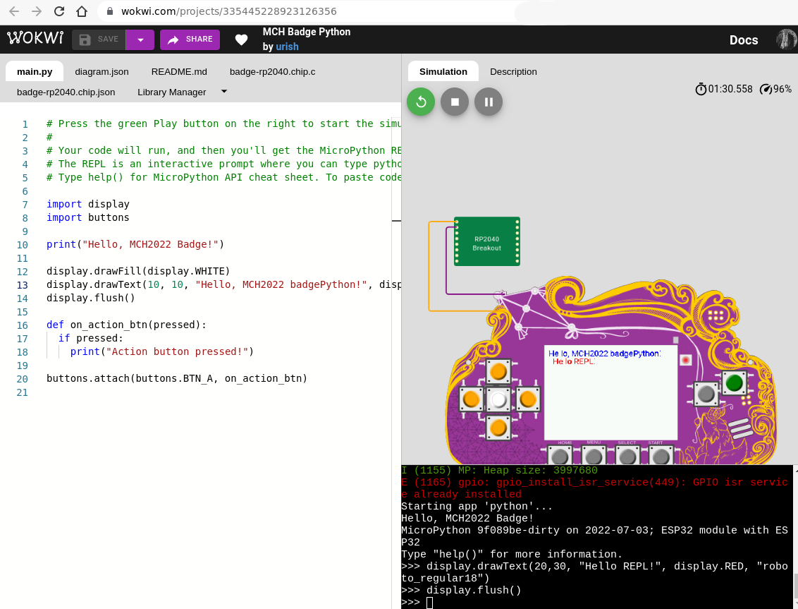

# Introduction ...

This is a shameless placeholder for the software development section.

There are roughly 3 to 5 ways to develop for the Badge (depending on how
you count:)

- Micropython : write app in Python! This is the easiest way to get
  started, with the additional benefit that you probably don't need
  to install anything (or much)
- ESP-IDF : native EPS apps using the IDF
- FPGA : this is the special feature ... not happy with the Tensilica
  CPU on the ESP? Just implement your own RISC-V core (or, to get
  started, connect all the buttons together with an AND gate...)

The other two:

- Arduino: this was intended to be done and beautifully polished ... but
  then we all got COVID and couldn't finish. You can try to develop apps
  with Arduino if you think it will be easier, but it will probably
  cause some pain. Of course, we would be ecstatic if you help getting
  it work smoothly.
- RP2040: aka Raspberry Pico. This is an onboard conprocessor that we
  are using as our USB Lifeline to the outside world. As such, if you
  break stuff here, you can easily brick your badge. Feel free to play
  around with it, but be aware: THIS VOIDS YOUR WARRANTY ... and not in
  a fun way. It's very unlikely we'll have the resource to help you fix
  the badge during the camp.

## Linux permissions

Regardless of the way you're going to program the badge, to connect to the badge over USB from Linux, do the following.

Create `/etc/udev/rules.d/99-mch2022.rules` with the following contents:

```
SUBSYSTEM=="usb", ATTR{idVendor}=="16d0", ATTR{idProduct}=="0f9a", MODE="0666"
```

Then run the following commands to apply the new rule:

```
sudo udevadm control --reload-rules
sudo udevadm trigger
```

# Micropython

The Badge comes with a preinstalled Micropython interpreter. Python
should be the easiest way to control the device and the easiest mode to
write apps for The Badge, especially if you are a beginner or don't want
to spend a lot of time downloading toolchains and debugging drivers.

## Before the Camp and if you are afraid to break things...

Uri Shaked a.k.a [Wokwi](https://wokwi.com/projects/335445228923126356) built
an awesome emulation of the badge that runs in your browser. You can use it to
test stuff out if you don't yet have a Badge or your Badge is being used for
something else. Or if you just feel more comfortable with a Badge that can't
catch on fire. It fantastic, you can click the buttons and everything! [Try it.](https://wokwi.com/projects/335445228923126356)



## On the device!

First, make sure Python is installed and that you didn't accidentally
delete it. Check in the `apps` menu. If it's not there: install the
Python app from the Hatchery by going to `Hatchery -> ESP32 native
binaries -> Utility -> Python` and install it either onto the flash or
onto an SD card.

This badge contains a common ESP32 firmware platform shared with other
badges, so to learn more about the general platform and its components,
[start
here](../../../esp32-platform-firmware/esp32-app-development/getting-started/first_egg/).
In addition there is also a `mch22` module that offers a few
badge-specific APIs.

While the above allows you to access the Python shell and install Python
apps from the hatchery, here is how you upload custom apps to the badge
over USB:

1. Download [mch2022-tools](https://github.com/badgeteam/mch2022-tools/archive/refs/heads/master.zip)
2. Write you Python code using the platform modules documented above
3. Use `python3 webusb_fat_push.py __init__.py /sdcard/apps/python/myapp/__init__.py`
4. Start your app in the Apps menu.


