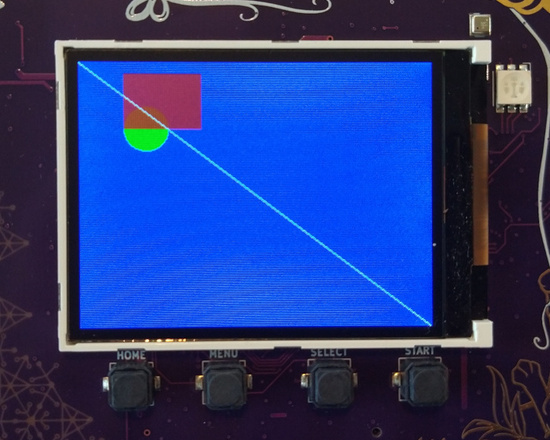

PAX Graphics is the default way to draw graphics for the MCH2022 badge.
Don't want the getting started? [Complete API can be found here.](https://github.com/robotman2412/pax-graphics/tree/main/docs#pax-graphics-documentation)


# Getting started

First, download [the template app](https://github.com/badgeteam/mch2022-template-app):

```bash
git clone https://github.com/badgeteam/mch2022-template-app my_fancy_app
make install
```

This will download and install the template app to your badge, showing a
colorful "Hello, World!".

Simply repeat the `make install` step every time you want to test your app.

To avoid clutter, remove the graphics from the while loop and make a function
containing just the graphics code:

```c
// before main ...
// A neat little graphics function.
void my_fancy_graphics() {
    // This fills the screen with blue.
    // Color:              aarrggbb (like #rrggbb but with 0xff instead of #).
    pax_background(&buf, 0xff0000ff);
}
// in main ...
    while (1) {
        // Call our graphics function.
        my_fancy_graphics();
        // Draw them to the screen.
        disp_flush();
        
        // Await any button press and do another cycle.
        // Structure used to receive data.
        rp2040_input_message_t message;
        // Await forever (because of portMAX_DELAY), a button press.
        xQueueReceive(buttonQueue, &message, portMAX_DELAY);
        
        // Is the home button currently pressed?
        if (message.input == RP2040_INPUT_BUTTON_HOME && message.state) {
            // If home is pressed, exit to launcher.
            exit_to_launcher();
        }
    }
//...
```
Note that graphics aren't immediately shown on screen, this is handled by `disp_flush()`.

## Simple HelloWorld

Let's start by drawing some white text on the blue background:

```c
//...
// A neat little graphics function.
void my_fancy_graphics() {
    // This fills the screen with blue.
    // Color:              aarrggbb (like #rrggbb but with 0xff instead of #).
    pax_background(&buf, 0xff0000ff);
    // This draws white text in the top left corner.
    float text_x     = 0;                   // Offset from the left.
    float text_y     = 0;                   // Offset from the top.
    char *my_text    = "Hello, World!";     // You can pick any message you'd like.
    float text_size  = 18;                  // The normal size for saira regular.
    pax_draw_text(&buf, 0xffffffff, pax_font_saira_regular, text_size, text_x, text_y, my_text);
}
//...
```


Play around with the parameters and see what happens. Try changing `text_x` and
`text_y` to see where it appears on screen, or maybe change `text_font` to (for
example) `pax_font_sky`.

## Using Images

Using images requires a bit more work, but is still easy to do.  First, you
must include `#include <pax_codecs.h>` in each file that decodes PNG
images.


Next, find an image that fits in memory (so make it small). Add this
to the `main` folder, next to `main.c` and include it in `CMakeLists.txt`:

```cmake
idf_component_register(
    SRCS
        # You source files are here, there might be more than just main.c
        "main.c"
    INCLUDE_DIRS
        # The directories to open header files from are here, again, there might be more.
        "." "include"
    EMBED_FILES
        # This is the location of your image.
        ${project_dir}/main/my_image.png
)
```

The `EMBED_FILES` directive causes the file's data to be included mostly as if it were a source file.
You reference the files like so:

```c
//...
extern const uint8_t image_start[] asm("_binary_my_image_png_start");
extern const uint8_t image_end[]   asm("_binary_my_image_png_end");
//...
```

This tells the compiler where to find the image.  When embedding files, [they
will always be named in a similiar manner](https://docs.espressif.com/projects/esp-idf/en/latest/esp32/api-guides/build-system.html#embedding-binary-data).

Finally, draw the image using `pax_insert_png_buf`.
If your image is located on the SD card or internal filesystem, use `pax_insert_png_fd` instead.
```c
//...
// A neat little graphics function.
void my_fancy_graphics() {
    // Blue background in case decoding the PNG fails.
    pax_background(&buf, 0xff0000ff);
    
    // Draws an image, but does not support transformations.
    pax_insert_png_buf(&buf, image_start, image_end-image_start, 0, 0, CODEC_FLAG_OPTIMAL);
}
//...
```


If your screen turned blue, then the image may have failed to decode.

Try running `make monitor` and re-opening the app to see what happened (most
likely, the image is too big to fit in memory). To exit `make monitor`, press
`CTRL+]`


## Getting more abstract

Of course, you can do much more than just drawing text!
Shown here is an example of drawing a rectangle, a circle and a line:

```c
//...
    // Draw a green circle (position is center).
    //                    color       x   y   radius
    pax_draw_circle(&buf, 0xff00ff00, 60, 60, 20);
    // Draw a transparent red rectangle (position is top left corner).
    //                  color       x   y   width  height
    pax_draw_rect(&buf, 0xb0ff0000, 40, 10, 70,    50);
    // Draw a white line across the entire screen.
    //                  color       x1  y1  x2         y2
    pax_draw_line(&buf, 0xffffffff, 0,  0,  buf.width, buf.height);
//...
```


PAX (the graphics) also supports [matrix
transformations](https://github.com/robotman2412/pax-graphics/tree/main/docs#api-reference-matrix-transformations).

In short, this feature allows you to stretch, resize, rotate and move around
drawing. Consider the following example:

```c
//...
    // Save this for later.
    pax_push_2d(&buf);
        // Modify the translation: shear it.
        pax_apply_2d(&buf, matrix_2d_shear(0.5, 0));
        // This will no longer have a circular shape.
        pax_draw_circle(&buf, 0xff00ff00, 60, 60, 20);
    // Restore the matrix.
    pax_pop_2d(&buf);
    
    // This will still have a rectangular shape.
    pax_draw_rect(&buf, 0xb0ff0000, 40, 10, 70,    50);
//...

```


## Where to Go from Here?

For further details about the library, have a look at the API reference in the library's repository, [robotman2412/pax-graphics](https://github.com/robotman2412/pax-graphics/tree/main/docs#api-reference)
