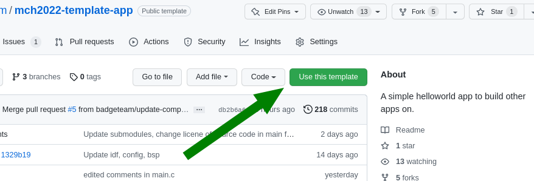

# Introduction

Even though MicroPython is a quick and easy way to write apps for the Badge,
you are limited both in terms of performance and functionality. If you need or
want to write native applications, you have found the right place. This section
describes how to develop Badge apps using the ESP-IDF, the development
toolchain for native ESP32 apps. 

## Should I write a native app?

TLDR: OF COURSE YOU SHOULD! It's fun! Hey, this Badge is for an event
called "May Contain Hackers", it was made for hacking in every possible way!

Native apps are amazing. The beautiful [sponsors
slideshow](https://github.com/badgeteam/mch2022-sponsors-slideshow) that you
saw when you first booted your Badge was a native app. The [BadgePython
interpreter](https://github.com/badgeteam/badgePython) that runs all the
BadgePython Eggs is a native app. Native apps are not launched within the Badge
firmware - they are directly mapped to memory and then the Badge is rebooted.
In other words: No walls, no fences around you. Ideally suited for writing
Badge malware! Your code runs directly on the metal. This makes native apps the
perfect option if you need full power and/or full access to all the MCU's
peripherals, not just the ones with a Python wrapper.

However, this comes at a (small) price: As native apps need to be directly
accessible to the ESP32, their binaries reside in a special partition in the
module's internal Flash memory (if you're interested in the magic behind it,
have a look at [the AppFS
component](https://github.com/badgeteam/esp32-component-appfs)). Because they
are standalone firmwares, they tend to be larger than simple MicroPython apps.
As a consequence, there is a limit to how many native apps can be installed on
a Badge (five-to-ten-ish, depending on code size). If you run out of memory,
you will have to uninstall others. 

## Getting Started

If you want to dive right in, here's a short example walktrough to [quickly get
started](./esp_idf_getting_started/) writing a native ESP-IDF app.

## Template App

The template app is a public template repository to use as a basis for your own
app. It contains an application skeleton, an appropriate version of the ESP IDF
and [components](../api/) for common Badge peripherals. You can find [the template app on
github](https://github.com/badgeteam/mch2022-template-app). All examples here
use this template. Basically: Clone, build, install, publish, fun.
Incidentally, the template app has a button you can use to create a clone for
your github user.

## A More Advanced Example

Once you are familiar with the template and getting started example, it's time
to move a step further. The ESP-IDF has tons of features to offer. Here's 
a [more advanced app](./esp-idf-advanced-example) which turns your badge into
a (crappy) bluetooth speaker.
