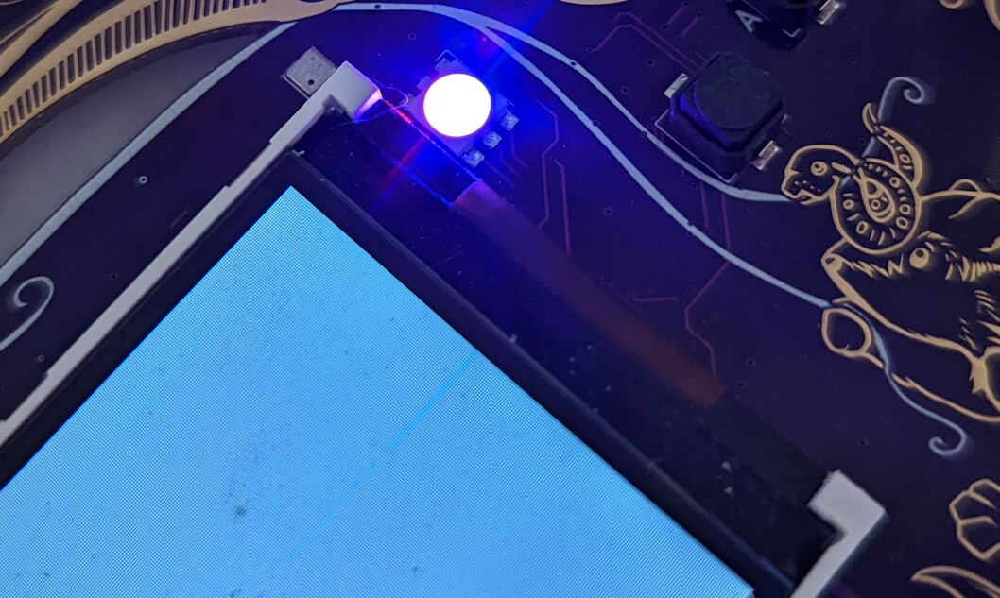

# Ok let's get real.

FPGA development is different from regular computer programming.
It's not necessarily more difficult, but the concepts involved are very different.

The **number one difference is**: in programming everything happens one things after another.
With FPGAs, everything happens at once. This probably does not make
sense yet, but it will.


## What even is an FPGA?

FPGA stands for Field Programmable Gate Array. A "normal" chip like the
ESP32 can also be considered a Gate Array. It's an array of logic gates
gates (`NAND`s `OR`s `NOT`s, etc.) that are wired together to form an
ESP32 CPU. An FPGA also contains a bunch of logic gates. But they aren't
wired together. You write a (kinda) program to explain the way the gates
are supposed to be wired together. This probably does not make sense
without an example. So let's get started.

## Verilog

The (kinda) programming language almost all the examples use will be
Verilog. It looks like this:

```verilog
	// this is what comments look like
	/* or like this */

	// verilog is structured into `modules`
	module AND (input  a,   // modules have `wires` coming into them
	            input  b,
	            output c);  // or going out. Direction matters.
		                // there is also `inout`

		    // everything else is _just_ like Javascript.
		    assign c = a & b; // semicolons are mandatory

	endmodule // unless they're no. It depends.
```

The code above builds a logical AND abstraction. It take `a` and `b`
coming into the module, and's them together and assigns the resulting
value to `c`. When the code gets run through the toolchain (the analog
of "compiling" in FPGA-lang is synthesis) the toolchain search in its 
database for unused structures within the target FPGA that can be used
to create such an AND. 

These structures are called look-up tables (LUTs), because they can be
configured to take a bunch of inputs and look up what the output should
be in a table. For our AND the configured LUT will look like this:

|a/b|0|1|
|-|-|-|
|**0**|0|0|
|**1**|0|1|

# This is *still* really abstract
## Install the tools

Ok, let's get started for real. First clone out repo  :

```
$ git clone git@github.com:badgeteam/mch2022-firmware-ice40.git --recursive
	Cloning into 'mch2022-firmware-ice40'...
	remote: Enumerating objects: 1333, done.
	remote: Counting objects: 100% (345/345), done.
	remote: Compressing objects: 100% (229/229), done.
	remote: Total 1333 (delta 193), reused 251 (delta 115), pack-reused 988
	Receiving objects: 100% (1333/1333), 1.97 MiB | 4.15 MiB/s, done.
	Resolving deltas: 100% (690/690), done.
..... 8< ....  snip snip snip boring .....

$ cd mch2022-firmware-ice40/
$ cat README.md
..... 8< ....  snip snip snip boring .....

Get the latest package for your computers architecture: 
https://github.com/YosysHQ/oss-cad-suite-build/releases

..... 8< ....  snip snip snip boring .....
```
... and then download all the necessary tools
from https://github.com/YosysHQ/oss-cad-suite-build/releases

```bash

$ mkdir toolchain && cd toolchain
$ wget https://github.com/YosysHQ/oss-cad-suite-build/releases/download/$MY_TOOL_CHAIN_IT_DEPENDS!

oss-cad-suite-linux-arm64 47%[================>                     ] 185,29M  6,93B/s    eta 31h
..... 8< ....  snip snip snip boring .....

$ tar -xzf $WHATEVER_YOU_JUST_DOWNLOADED
$ cd ..
$ source toolchain/$WHATEVER/environment
```

Awesome you're ready. Let's get started for real. All the examples are
in the [`projects` subdirectory](https://github.com/badgeteam/mch2022-firmware-ice40/tree/master/projects) in the mch2022-firmware-ice40 folder that you cloned from Git.

- `_common`          : stuff needed everywhere 
- `Buttons`          : ~fairly simple example that wires together all the buttons to change the RGB LED colors
- `Fading-RGB`       : even simpler example that just fades the LEDs
- `Fading-White`     : ...
- `Forth`            : a stack CPU that's designed to run Forth 
- `Hello-World`      : looks like a good starting place !
- `Ledcomm`          : ... have a look around
- `riscv_doom`       : game. running on a cpu synthesized onto the FPGA
- `RISCV-Playground` : ... it's 47 degrees C 
- `selftest`         : ... you need to do some looking around yourself.
- `Snake`            : better game
- `spi_skeleton`     : ... it build character
- `spi-to-rgb`       : ... and I'm lazy

So, if you looked around, all the examples are structured similarly:

- they contain a `Makefile` we use this to turn the designs into
  `bitstream`. Those are basically a bunch of bits that are used to
  configure or Program the Array of Gates. And you are sitting in a
  Field.
- Most already contains a `*.bit` file. This is the bitstream for the
  example. You could just load it to the badge.
- There is an `rtl` directory containing `*.v` files. `*.v` is the
  extension for Verilog. RTL stands for "Register Transfer Logic (or
  Language" and describes the aspect of Verilog that looks more like Javascript
  but is able to be converted into logic gates. 
- The CPU projects also contain software to run on the CPU and possibly
  a toolchain to compile the software
- misc other stuff

# ENOUGH ALREADY you're boring me to pieces ...
## Build the Project

Ok, we'll start with 'Hello World'. If you followed the instructions,
you just need to type `make` and everything works:

```
$ make
cd /mch2022-firmware-ice40/projects/Hello-World/build-tmp && \
	yosys -s /mch2022-firmware-ice40/projects/Hello-World/build-tmp/hello-world.ys \
		 -l /mch2022-firmware-ice40/projects/Hello-World/build-tmp/hello-world.synth.rpt
/mch2022-firmware-ice40/toolchain/oss-cad-suite/bin/yosys: line 6: /mch2022-firmware-ice40/toolchain/oss-cad-suite/lib/ld-linux-aarch64.so.1: cannot execute binary file: Exec format error
/mch2022-firmware-ice40/toolchain/oss-cad-suite/bin/yosys: line 6: /mch2022-firmware-ice40/toolchain/oss-cad-suite/lib/ld-linux-aarch64.so.1: Success
make: *** [../../build/project-rules.mk:88: /mch2022-firmware-ice40/projects/Hello-World/build-tmp/hello-world.json] Error 126

```

Urgh. I screwed this up, but because one or two of you will screw this
up as well, I thought I'd leave it in. If you look carefully at the
error message, you'll see something about `aarch64`. Which is ARM stuff.
I'm using Badger-Basic on an x86, so I downloaded the wrong tools.
Drat. (I actually managed to download the wrong tools twice :m)

... Several minutes later ...

```bash
$ make
cd /mch2022-firmware-ice40/projects/Hello-World/build-tmp && \
	yosys -s /mch2022-firmware-ice40/projects/Hello-World/build-tmp/hello-world.ys \
		 -l /mch2022-firmware-ice40/projects/Hello-World/build-tmp/hello-world.synth.rpt

.... 8< ....  snip snip snip totally not boring but lots of it ..... 

Info: Program finished normally.
icepack -s /mch2022-firmware-ice40/projects/Hello-World/build-tmp/hello-world.asc /mch2022-firmware-ice40/projects/Hello-World/build-tmp/hello-world.bin

```

# Ok. Are we done yet?
## Install on the Badge

Almost. Now we only need to push the newly generated bitstream onto the
badge. And then we get to the exciting part: explaining how it all
works! Use the `webusb` tools to push the bitstream:

```
 $ cd ../../tools/
 $ python webusb_fpga.py ../projects/Hello-World/hello_world.bin 
Waiting for ESP32 to boot into FPGA download mode...
Sending bitstream : ...................................................
```

If this didn't work, and there are error messages concerning USB, you
need to install `pyusb`. Try something like:

```
$ pip install pyusb
... or
$ apt install python-usb
```



What you can't tell from the picture is that the LED is actually
blinking. In different colors. Super cool.

# So ... you said you'll explain how this all works...

I also said I'm lazy and it's 47 degrees Celcius. This section may be
expanded upon or left abandoned with good intentions of finishing it up
before MCH2022. \*cough\*

If it's not done, either read the [more about advanced
examples](../fpga) or head over to the [fpga
repo](https://github.com/badgeteam/mch2022-firmware-ice40/tree/master/projects),
there is a lot of information there. Also, come by the workshops at the
camp to chat.

<!-- 

- add information about Yosys Flow and individual steps
- ... pnr and icepack
- ... constraints
- .. rant about vendor tools.
- ... maybe simulation? verilator gtkwave :D
- quick walkthrough of helloworld.v, default_nettype, macros
-->

# Further Resources

No matter how far we get, this will not turn into a "Learning Verilog"
Tutorial. Here is a list of resources we like to learn more about FPGA
development:

- Best Verilog Tutorial IMO: [Zip CPU Verilog, Formal Verification and
  Verilator Beginner's Tutorial](http://zipcpu.com/tutorial/)


<!--
** Takeaways ** 
- `a`, `b` and `c` are physically wires within the FPGA
"fabric". They carry one bit of information.

- Verilog looks like C or Pascal, but is weird.
-->
