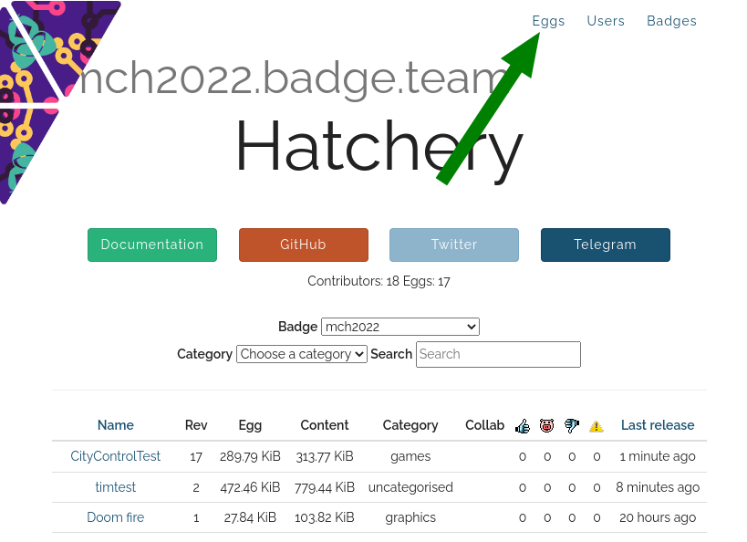
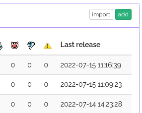
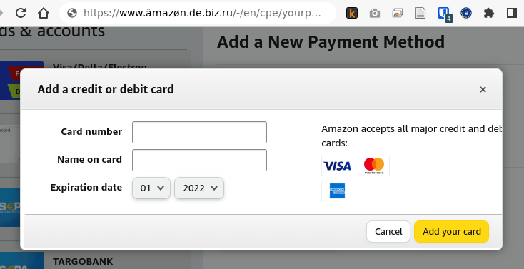
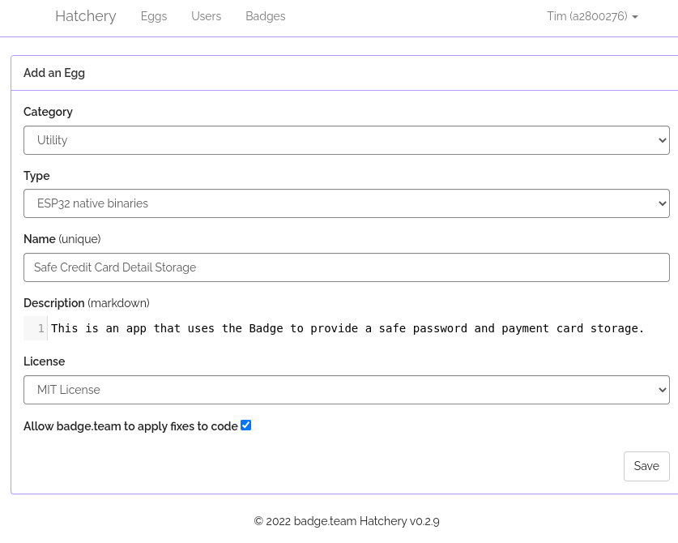
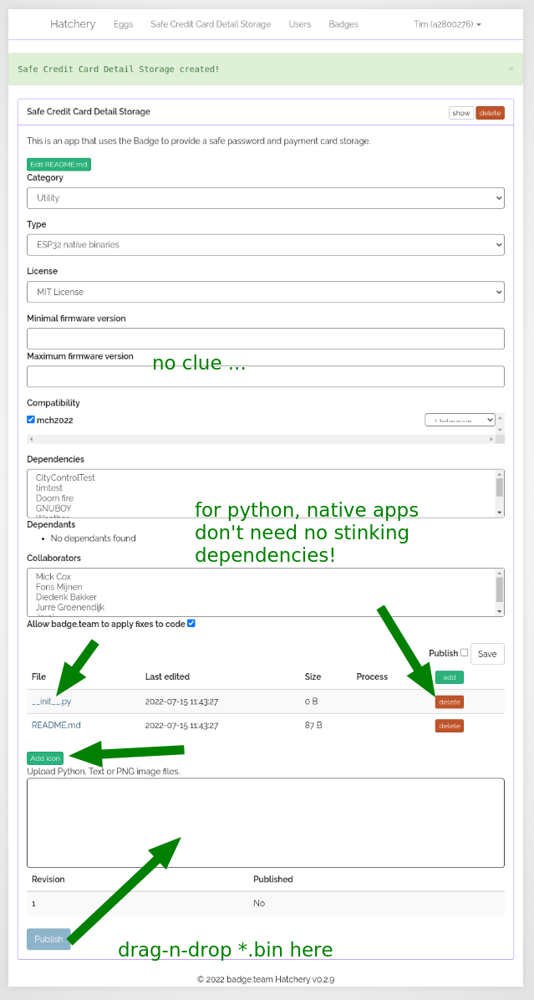
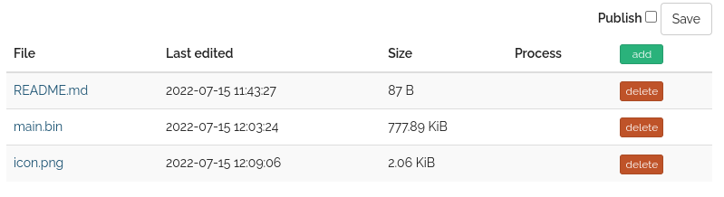
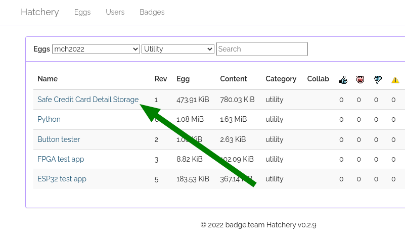
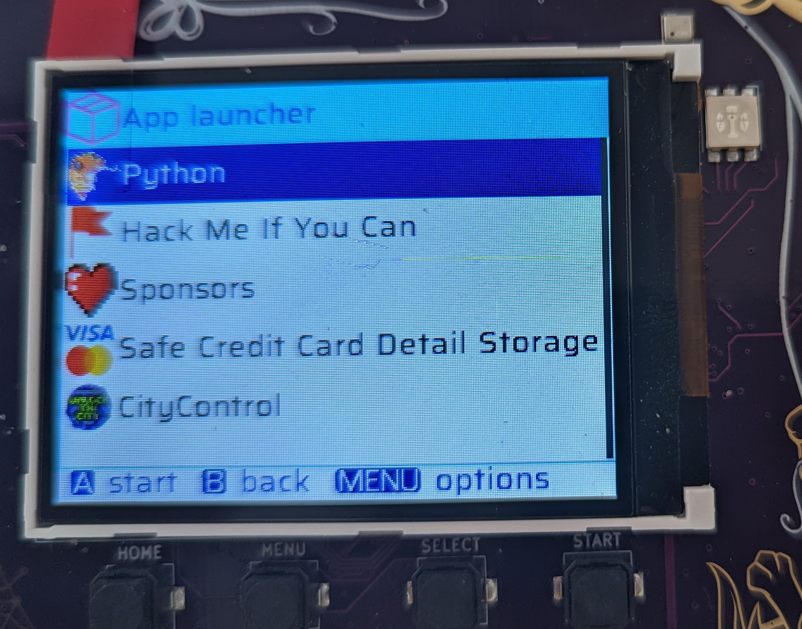

## WTF is a Hatchery!?

The Hatchery is an app store for The Badge!  You can use the Hatchery to
publish your own apps and share them with friends. And unlike other App Stores,
you don't need a Dunn & Bradstreet Number, $1000 and don't have to worry about
your app being rejected because it contains malware.

You can also sort through the apps other people have published there.  If you
do so, please be aware that we don't check for malware and will NEVER ask for
your credit card number or home banking password (just kidding, off course we
will.)

BTW, it's called Hatchery because it (used to) contain "eggs" because
previously the Hatchery was limited to [Micropython apps](../micropython) and those are
called eggs. Knowadays the Hatchery also supports native [ESP Apps](../esp-idf) and [FPGA](../fpga)
bitstreams.

## Installing Apps from the Hatchery.

Probably not a good idea. It's full of malfware and half finished tutorial apps.
It's much better to [write your own app](../).

If you _insist_ on installing other peoples apps, please have a look at the
[instructions in the enduser section](../../getting-started/hatchery).

## Publishing a Native App in the Hatchery.

First off, we're having our _best_ UX experts work day and night to tweak the
Hatchery Website to make it even easier to use! So expect some of the
screenshot to be a bit out of date. Don't worry, you'll figure it out.

In case you are experiencing issues regarding [`419
Expired`](../../support/troubleshooting_faq/#i-keep-getting-419-errors-in-the-hatchery)
errors, try deleting Hatchery cookies from your browser.

### Create an Account

Go to [mch2022.badge.team](https://mch2022.badge.team/) and sign up for
a new account. Standard stuff, name and password, credit card details
...

### Create a new Native ESP App

We assume you have an app ready and built. If not, please check out the
[ESP-IDF App Getting Started tutorial](../esp-idf/esp_idf_getting_started)!

Now that you've written an app: Find the button to click on to create a new App:

- Click on "Eggs" in the top menu
- Click the "add" button
- Enter your credit card details

- Enter your credit card details

 

- and fill out the form. Please select a meaningful *category* else the
whole camp will descend into chaos and noone will be able to find
anything. For *Type* chose "ESP32 native binaries". Then choose a
meaningful and unique name.

- Write something in the *Description*, e.g. "won't let me submit without a
description", pick a license and off you go.

- Clicking "Save" may or may not pop up some warning, depending on whether
we fixed this. Have I mentioned, that we welcome pull requests? Just go
to the [github project for the
hatchery](https://mch2022.badge.team/projects/create)

- now you need to upload your app. You should be on the projects detail
  page which contains a bunch of stuff you can ignore:

  - min and max firmware version
  - Dependencies - this is for Python Apps that need other python apps
    preinstalled
  - Collaborators - this lists other Hatchery users who are allowed to
    edit the app details
  - checkbox "Allow badge.team to apply fixes to code" if you like other
    random strangers to poke around in your app to "fix bugs"

Ok, now comes the fun part. If you look at the arrows in the screenshot
above, you'll see that a `__init__.py` was created for your native app.
Don't need it, click delete (other arrow).

Then there is an "Add icon" button. I don't think it works. If you want
your app to have an icon, create a 32x32 pixel PNG image names
"icon.png" and drag onto the large text box with the arrow labeled
"drag-n-drop".

Finally you need to upload the actual firmware. We mentioned the [Getting
Started Tutorial](../esp-idf/esp_idf_getting_started). We weren't kidding
you'll actually have to do a stupid tutorial to get a firmware bin to upload. I
know ... lame. When you're done, you'll find the firmware in the `build`
folder. For the tutorial, it should already be called "main.bin", if not,
rename it. In case you're asking yourself: the *.bin file will be named the
same way your firmware project is named in the top level "CMakeLists.txt" file:
`project(main)`

### FPGA

If you are uploading an FPGA project, please name it `bitstream.bin`.

Once all the relevant stuff is there, click "Save" and if you are feeling
brave, check the "Publish" box, this allows others to see your app in the
store. As long as you don't publish, the app won't show up in The Hatchery, so
you can make changes. This is also useful if you plan a second release.

Your app should now be in the Hatchery!

and you ought to be able to [find it in the Hatchery app on your badge](../../getting-started/hatchery) and
install it and find it in the "App Launcher" Menu.

