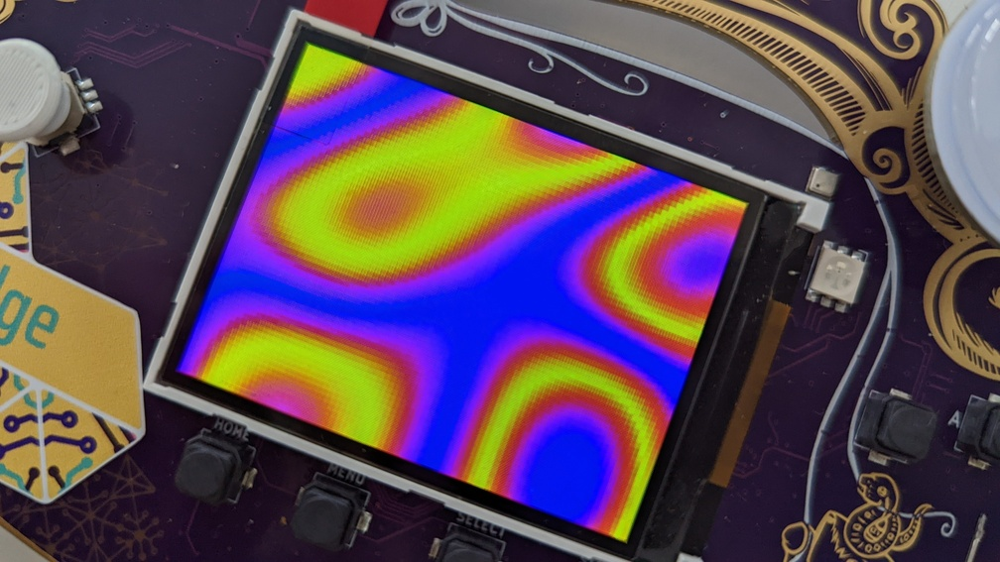

# Introduction

TinyGo is an alternative Golang implementation targeted towards constrainted
devices such as ... The Badge.  TinyGo's creator, Ayke van Laëthem, was kind
enough to not only hold [a talk about TinyGo at
MCH2022](https://media.ccc.de/v/mmch2022-82-programming-microcontrollers-in-go-using-tinygo)
but also write [two nice Badge examples](https://github.com/aykevl/things) and
explain how to develop with TinyGo on the Badge.

## Install TinyGo

- Grab the latest release from the [TinyGo github]() and follow the
  [installation instructions](https://tinygo.org/getting-started/install/) for
  your platform. This needs to be a version > 0.24. In the unlikely event you read this before
  the release, you can get a [special access pre-release]() of the tools from the CI
- To build for ESP32, Tinygo requires an xtensa toolchain. This will very
  likely have been installed on your computer if you have already
  built a native app. Else you will need to install one. Follow [these
  instructions from Espressif](https://docs.espressif.com/projects/esp-idf/en/v4.4.1/esp32/get-started/index.html#installation-step-by-step)
- Once you have completed installation, be sure to source the `export.sh`
  script (or the equivalent) to set all the necessary environment variables.
  TinyGo needs these to find the xtensa tools


## Grab some Demos ...

You can download Aycke's samples from [this repo](https://github.com/aykevl/things), the Badge example are in
directories name 'mch2022-something'.  Go into the relevant directories, read through
the examples and finally build and flash them to your Badge using the [mch2022 tools](https://github.com/badgeteam/mch2022-tools)


```
$ git clone https://github.com/aykevl/things.git
   ...
$ cd things/mch2022-leds/
$ tinygo build -o leds.bin -target=mch2022
$ ls
go.mod  go.sum  leds.bin  LICENSE.txt  main.go  README.md
$ python webusb_push TinyGoLeds leds.bin

```

A new app named 'TinyGoLeds' will appear in your app menu. When you run it, the
LED kite will oscillate in different colors, but the screen will be stuck in the
"Starting in App" mode. This is because nothing is being written to the screen.

Let's fix that. Go into the `mch2022-noise` example and build it... Stare in awe at the
beauty of the Simplex Noise being drawn to the screen!




