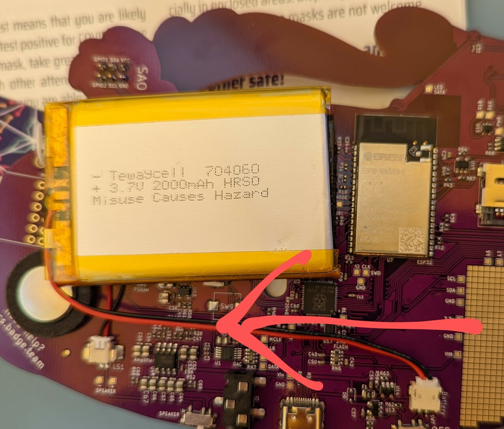

This page is intended to collect answers to questions that pop up frequently and
solutions to common problems...


# MicroPython crashes every time I connect to it ...
## Apparently I'm disturbing the Guru's Meditation

In case you are trying some Python samples and the firmware crashes ... like this:

```
Guru Meditation Error: Core  0 panic'ed (Interrupt wdt timeout on CPU0).

Core  0 register dump:
PC      : 0x40084b56  PS      : 0x00050035  A0      : 0x400d7fde  A1      : 0x3ffbe990
A2      : 0x00040040  A3      : 0x3ffb27e0  A4      : 0xc0000000  A5      : 0x3ffbe970
A6      : 0x3ff40000  A7      : 0x3ffbf074  A8      : 0x800d7fde  A9      : 0x40090908
A10     : 0x00000000  A11     : 0xa6000000  A12     : 0x00000000  A13     : 0x00000473
A14     : 0x3f403a98  A15     : 0xffffffff  SAR     : 0x0000001f  EXCCAUSE: 0x00000005
EXCVADDR: 0x00000000  LBEG    : 0x4000c2e0  LEND    : 0x4000c2f6  LCOUNT  : 0xffffffff
Core  0 was running in ISR context:
EPC1    : 0x400d3f03  EPC2    : 0x400d7fde  EPC3    : 0x00000000  EPC4    : 0x00000000


Backtrace:0x40084b53:0x3ffbe9900x400d7fdb:0x3ffb27e0 0x401d505f:0x3ffb2800

```

We are [working on it](https://github.com/badgeteam/badgePython/issues/25):

- make sure you've updated your BadgePython to the newest version. Use the `AppUpdate` menu item...
- try deleting Python from the `Apps` menu and reinstalling it from The Hatchery (`Hatchery->ESP32->Utilities`)


If none of this helps, here's an easy work around ... Connect to the serial console *before* you start Python. While you're still in the launcher, connect, you will see some of the logging of the launcher application, when you start Python, you will see the boot messages. If the serial console is already attached when Python starts, it doesn't crash. WTF!? ¯\\_ (ツ)_/¯


# I keep getting 419 errors in the Hatchery!

If you can't log in to the Hatchery (or create an account) or whatever because you are getting `419 Expired` errors, you need to either clear all cookies for the Hatchery, use incognito mode to connect or try a different browser. Please also report your experience, inlcuding time of occurance in the [issue concerning this behavior](https://github.com/badgeteam/Hatchery/issues/163) to help figure this out.

# My SD-Card is not being recognized

Try formatting the card as FAT32. Unfortunately exFAT is currently not supported.

# The wifi doesn't work!

Your battery is probably too close to the ESP32 "tin can". Try moving it over
:) The black strip on top of the can is the wifi antenna, you need to make sure
that bit is not covered by anything.




# The kite in the front is flashing RED!? Am I in danger!?

You're probably fine. But be sure to drink plenty of water.
But you will need to:

- Download the the [RP2040 coprocessor firmware U2F](https://github.com/badgeteam/ota/blob/master/mch2022-rp2040/mch2022.uf2)
- Turn the Badge off ( with the switch labeled ON-OFF)
- Hold the `SELECT` button while turning the switch back to ON
- Make sure a USB cable is connected to your computer
- The Badge will mount as a mass storage device (MSD, a.k.a USB thumbdrive)
- Drag-n-drop (or whatever it is you Linux-from-Scratch folks do ...) the U2F firmware onto the drive

This sounds way more complicated than it is, you'll figure it out. In case you
don't that means we msessed up something else as well, please bring your Badge
to the [Badge tent](https://map.mch2022.org/#map=20/5.5274/52.2839/0) so we can
have a look to see what went wrong.
# The badge doesn't connect to the computer

If you have followed the instructions concerning [`udev`
rules](/docs/badges/mch2022/software-development/#linux-permissions), you may
have a bad USB cable. Or a charging only cable. Did you make sure to connect
one end of the cable into the computer and the other into The Badge?  Try
running `lsusb`, it should contain an entry like the one below:

```
$ lsusb
...
Bus 002 Device 025: ID 16d0:0f9a MCS MCH2022 badge
...

```
If instead, you see a line like this:

```
Bus 002 Device 027: ID 2e8a:0003 Raspberry Pi RP2 Boot
```

You may be having some issues with the Bootloader, have a look
[here](../../software-development/rp2040/) for some hints.

Try running `lsusb` without a badge and see if you get different messages when
a Badge is connected.

If this is not the case, try out a friend's cable.


# Button presses are glitching/bouncing‽

Your badge is probably not broken. Try updating the OS first. Choose "OS
Update" in the main menu.


# OMGWTFBBQ "FAIL"!?

In case you see this when first booting your Badge:


Don't worry, that just means one of the elves in Santa's workshop forgot to
confirm that the self-test passed. Plug it into USB, and press A.
