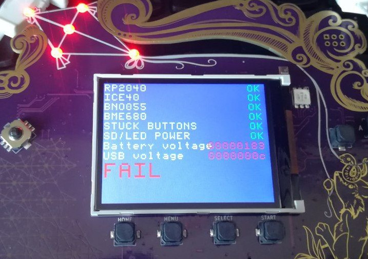

This page is intended to collect answers to questions that pop up frequently and
solutions to common problems...

# OMGWTFBBQ "FAIL"!?

In case you see this when first booting your Badge:



Don't worry, that just means one of the elves in Santa's workshop forgot to
confirm that the self-test passed. Plug it into USB, and press A.


# The kite in the front is flashing RED!? Am I in danger!?

You're probably fine. But be sure to drink plenty of water.
But you will need to:

- Download the the [RP2040 coprocessor firmware U2F](https://github.com/badgeteam/ota/blob/master/mch2022-rp2040/mch2022.uf2)
- Turn the Badge off ( with the switch labeled ON-OFF)
- Hold the `SELECT` button while turning the switch back to ON
- Make sure a USB cable is connected to your computer
- The Badge will mount as a mass storage device (MSD, a.k.a USB thumbdrive)
- Drag-n-drop (or whatever it is you Linux-from-Scratch folks do ...) the U2F firmware onto the drive

This sound way more complicated than it is, you'll figure it out. In case you
don't that means we msessed up something else as well, please bring your Badge
to the [Badge tent](https://map.mch2022.org/#map=20/5.5274/52.2839/0) so we can
have a look to see what went wrong.

# The badge doesn't connect to the computer

If you have followed the instructions concerning [`udev`
rules](/docs/badges/mch2022/software-development/#linux-permissions), you may
have a bad USB cable. Or a charging only cable. Did you make sure to connect
one end of the cable into the computer and the other into The Badge?  Try
running `lsusb`, it should contain an entry like the one below:

```
$ lsusb
...
Bus 002 Device 024: ID 0403:6015 Future Technology Devices International, Ltd Bridge(I2C/SPI/UART/FIFO)
...

```

If this is not the case, try out a friends cable.

# The wifi doesn't work!

Your battery is probably too close to the ESP32 "tin can". Try moving it over :)


# Button presses are glitching/bouncing‽

Your badge is probably not broken. Try updating the OS first. Choose "OS
Update" in the main menu.
