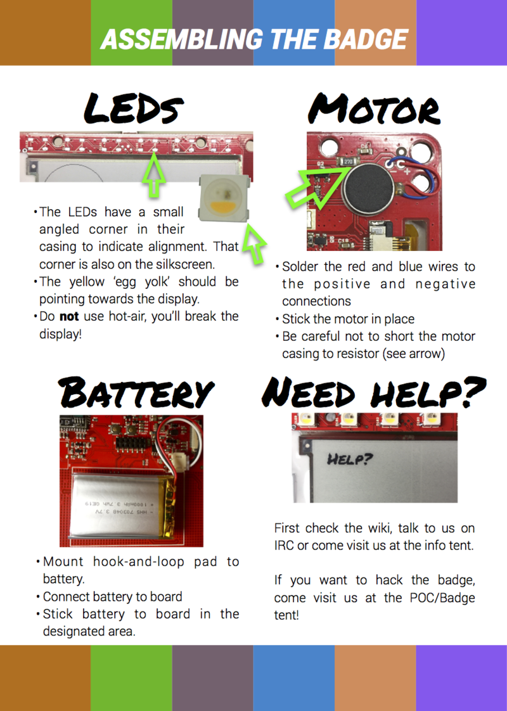
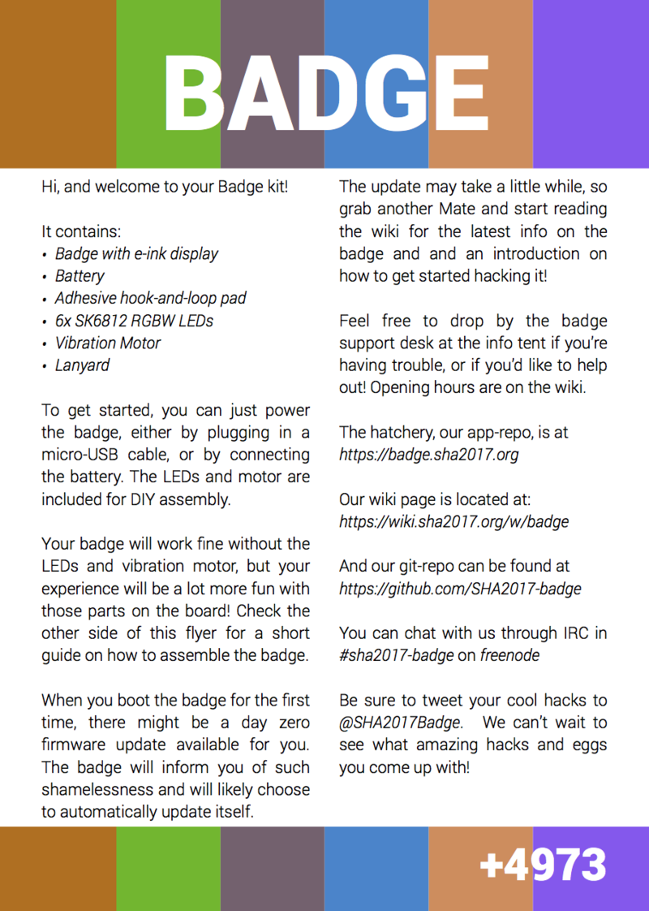
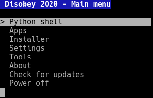

Please remember the badge project is a huge volunteer effort - please approach it as a hacker, not as a consumer :). Lots of things can still be improved, and your help is much appreciated! This still holds true August 2019!

## Unpacking and assembling

### WiFi setup
You can configure the WiFi network by starting the WiFi setup app on your badge.

By default the badge will try to connect to an open network called "SHA2017-insecure".

### OTA update
The first thing to do after starting up the badge for the first time is do an OTA (Over The Air) update.
This will make a connection with the hatchery and download the latest available version of the badge software. 

## Booting the badge for the first time and general use

When booting for the first time the badge will still be on the (now very old) firmware that it came with out of the box.
Following the steps below allows you to easily get to the latest-greatest firmware we have to offer.

### Nickname configuration
After the badge starts for the first time you will be prompted to enter your nickname. You can do so by selecting keys on the on-screen keyboard and pressing A to press the selected key.

Once you are done you can press the *select* button to switch to the OK/CANCEL buttons. The OK button is selected by default. Press A to click on the on-screen OK button.

If you *don't* enter a nickname you will instantly skip the sponsor reel and drop into the menu!

### Configuring WiFi
When you first enter the main menu the badge will try to connect to the SHA2017 network. Wait for the WiFi connection to fail and press START to enter the app launcher.

Select the "WiFi setup" app, pick your network from the list and enter the password.

Then wait (again) for the main menu to do it's thing and press START to open the launcher again.

This time select "OTA update" or "Firmware update" from the menu. This will start the upgrade process.

### Connecting to your computer
When connected to your computer using the USB connection of your badge you can access a handy menu system to configure your badge as well as a full Python prompt. Connecting to your computer allows you to see what's going on inside the software of your badge, allowing you to debug your app, test new code snippets, upload files and load new or custom firmware.

To get started [install the driver](../driver_installation), download a terminal emulation program of your choice (for Windows we recommend either [TeraTerm](https://ttssh2.osdn.jp/index.html.en) or [Putty](https://www.chiark.greenend.org.uk/~sgtatham/putty/latest.html)) and connect to your badge at *115200* baud. After waking up your badge from sleep mode you should be presented with a menu.

For more information on the serial console of your badge please have a look at the [USB-serial connection](/esp32-app-development/usb_connection/) article of the [App development](/esp32-app-development/) section.

### And now?
Congratulations! You should now be on our new platform firmware. Note that not everything works yet and that you might experience some problems.

Having problems? We have a [troubleshooting](../troubleshooting) page just for that.

Want to start developing apps? check out out [App development](/esp32-app-development/) section.
