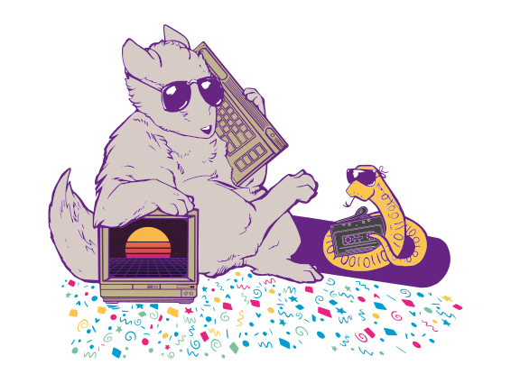

# WHY2025

The badge of the upcoming [WHY2025 hacker conference camp](https://why2025.org) is currently in the process of being designed. If you're interested in helping please contact us by joining our telegram group and asking for Lukas (@dalu).

The camp is organized for and by volunteers from and around all facets of the international hacker community. It attracts about 3500 hackers from all around the globe. Knowledge sharing, technological advancement, experimentation, connecting with your hacker peers and of course hacking are some of the core values of this event. During the camp there are hundreds of talks and activities to participate in.

WHY2025 is an international non-profit outdoor hacker camp/conference taking place in The Netherlands in the summer of 2025. It is the successor of a string of similar events happening every four years: GHP, HEU, HIP, HAL, WTH, HAR, OHM, SHA and MCH. Similar events are EMF in the UK and CCC Camp in Germany.

# The badge

Back in 2022 we built you a handy games console, pushing the limit's of what is possible using the original ESP32 microcontroller and even going above and beyond by adding an FPGA into the mix.

This time the badge will be completely different of course! The device will be the portable computer you wish you had in the 80s. Complete with on-device programming environment, a big screen and a full QWERTY keyboard this device is all the computing power you will need during the event.

## The brain

The brand-new ESP32-P4 will be the star of the show, with it's dual-core 400MHz RISC-V processor, 32MB of RAM and plenty of peripherals for communication the badge will be a showcase of state of the art IOT technology.

WiFi, Bluetooth and even 802.15.4 mesh networking are available thanks to the ESP32-C6 module included on the board.

## The plan

# Hardware sponsors

  
  
  &emsp;&emsp;&emsp;&emsp;&emsp;&emsp;&emsp;&emsp;&emsp;&emsp;

* **ALLNET China** was our production partner, for which we are more than grateful. They took care of sourcing most components and oversaw the production process [in China][ALLNET China], saving us a lot of work and potential headaches and allowing us to focus on the product!
* **Espressif** was very generous to donate us all of the [ESP32-WROVER-E][ESP32] modules we needed. The ESP32 has proven itself to be a solid basis for badges in the past, and for related projects such as the [PocketSprite]. Espressifs continued support means a lot to us as it allows us to continue expanding our existing ESP32-based ecosystem!

All of our sponsors helped us out in a time when sourcing capable chips was a near-impossible task. Without them, this project would not have been possible. We are grateful to all of them for their help and sponsorship, and we hope to work with them again in future badge projects!

[ALLNET China]: https://www.allnet.de/en/allnet-brand/unternehmen/weltweit/
[ESP32]: https://www.espressif.com/en/products/modules/esp32
[PocketSprite]: https://pocketsprite.com

## The team

The WHY2025 badge would not have been possible without the help of these amazing volunteers.

...

