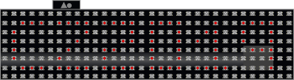
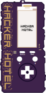
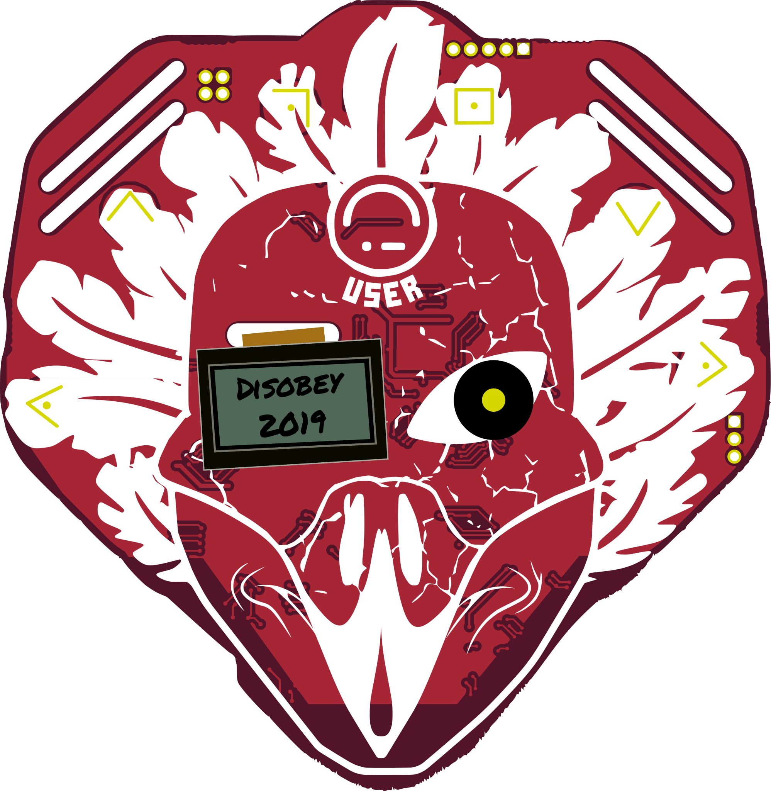

One of the aims of the BADGE.TEAM project is to ensure that as many people as possible can develop software for the platform. This ensures that badges and other hardware running our firmware are more likely to have a life beyond the event for which they were created.

The problem with many event badges has been that the learning curve for new developers is too steep and the acceptance process for new software too difficult. When detailed knowledge of a toolchain is required to write code and each addition must wait to be built into a fresh badge firmware update, most would-be developers go away and enjoy the event instead.

With an online app store we refer to as the *hatchery* and MicroPython apps we refer to as *eggs*, publishing new software for badges running our firmware is a much simpler process.

Not everybody is immediately familiar with a new platform though, so to help with your first badge egg we've created this tutorial. The aim is not to teach you Python but to introduce you to the structure of an extremely basic egg as well as get you going with the user interface. We'll be following the time-honoured tradition of introducing you to badge programming with a "Hello world" egg.

## Connecting to your badge

First make sure you're able to connect to your badge. The exact driver needed for the USB to serial bridge on your badge differs. Make sure to follow the guide for your specific badge.

After you have installed the correct driver you can connect to your badge using a terminal emulation program.

For Windows we recommend either [TeraTerm](https://ttssh2.osdn.jp/index.html.en) or [Putty](https://www.chiark.greenend.org.uk/~sgtatham/putty/latest.html)).

Connect to your badge at *115200* baud. After waking up your badge from sleep mode you should be presented with a menu. You can wake your badge up from sleep mode either by pressing or touching a button or by pressing the RESET button (if available).

#### [After you've succesfully connected to your badge you can continue your quest by creating your first egg, click here!](first_egg).

## Which type of badge do you have?

The different badges do not all have exactly the same hardware, so there are some slight differences in the setup process. 

Please click on the badge you have to go to the getting started guide for your badge.

| Badge                                                                     |                                                                           |
|---------------------------------------------------------------------------|---------------------------------------------------------------------------|
| [CampZone 2020](campzone-2020)                                              |                                                                 |
| [Disobey 2020](disobey-2020)                                              | (Secret!)                                                                 |
| [CampZone 2019](campzone-2019)                                   |                      |
| [HackerHotel 2019](/docs/badges/hackerhotel-2019/getting_started/)             |                   |
| [Disobey 2019](/docs/badges/disobey-2019/getting_started/)                     |                  |
| [SHA2017](/docs/badges/sha2017/getting_started/)                               |                           |

