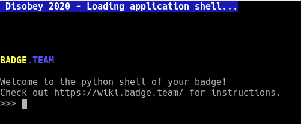

In this tutorial you will create an app which displays "Hello, world!" on the display of your badge, while reacting to input from the buttons on your badge.

## Executing code
After you connect to your badge (and wake it up) you will be greeted by the built in menu. Selecting the "Python shell" menu option and pressing *RETURN* to accept you will be greeted by a prompt.



On this shell you can type python commands like you would on a computer. For example you could enter ```print("Hello, world!")``` to have your badge echo that same text back to you.

Should you want to paste bigger chuncks of code at once then you can use the builtin "paste mode" to do so. You can access this mode by pressing ```CTRL+E``` on your keyboard. You can then press ```CTRL+D``` to execute the pasted code or press ```CTRL+C``` to cancel.

Pressing ```CTRL+D``` outside of paste mode will reboot your badge, returning you back to the menu.
Pressing ```CTRL+C``` outside of paste mode will stop the currently running command or app and return to the shell.

## The display

To display text, images, shapes or other graphics on the display of your badge you use the [display](../../api-reference/display/) API.

The following example code demonstrates how to display some text on the display of your badge. It consists of four commands.

First we import the display library, allowing us to use the functions of this library in our app.

Then we fill the display with white (0xFFFFFF) and draw on top using black (0x000000). These colors are in RGB24 format, which is also commonly used for web-development. If you never heard of colors in the #000000 format then you might want to look up a tutorial on web colors first.

Even after filling the screen with white and drawing some text the display hasn't been updated, it will still be showing whatever it did before we started... To send the buffer we just manipulated to the display you use the *flush* command. This way of working allows you to assemble an image before updating the screen.

```
import display

# Fill the framebuffer with white
display.drawFill(0xFFFFFF)

# Draw text at (0,0) in black using the 'PermanentMarker22' font
display.drawText(0,0,"Hello, world!", 0x000000, "PermanentMarker22")

# Flush the contents of the framebuffer to the display
display.flush()
```

Depening on your badge it might be wise to use a smaller font to test with, for example the ```7x5``` font.

```
import display
display.drawFill(0xFFFFFF)
display.drawText(0,0,"Hello, world!", 0x000000, "7x5")
display.flush()
```


## Buttons

For working with the buttons on your badge you use the [buttons](../../api-reference/buttons/) library.

Each button can be attached to a function with the following structure: ```def myCallback(pressed):```. The argument is ```True``` when the function was called because the button was pressed and ```False``` when the function was called because the buttton got released.

You can assign a function to each button separately using ```buttons.attach(<button>, <function>)```.

The following demonstration code shows how to react to a button:

```
import buttons

def myCallback(pressed):
	if pressed:
		print("Button callback: pressed!")
	else:
		print("Button callback: released!")

buttons.attach(buttons.BTN_A, myCallback)
```

## Combining the two!

```
import display, buttons

def message(text):
	print(text)
	display.drawFill(0xFFFFFF)
	display.drawText(0,0, text, 0x000000, "7x5")
	display.flush()

def myCallback(pressed):
	if pressed:
		message("Pressed!")
	else:
		message("Released!")

buttons.attach(buttons.BTN_A, myCallback)

message("Press the A button!")
```

If your badge does not have the ```A``` button then you can substitute that button with any other button. The Python prompt on your badge has tab completion. Just enter ```buttons.BTN_``` and press ```TAB``` on your keyboard for a list of available buttons.

## And further?
Documenting is hard and a very slow process for us hackers. Therefore we suggest you take a look at one of the many apps published in the [Hatchery](https://Badge.team) to gain some inspiration and to publish your own app.
