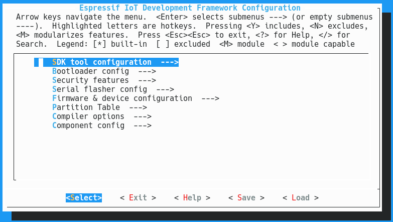

You can start menuconfig either by running ```./config.sh``` in the root of the repository or by executing ```make menuconfig``` in the ```firmware``` folder.

You will then be greeted by the main menu.



The menu contains the following submenus:

- SDK tool configuration
- Bootloader config
- Security features
- Serial flasher config
- Firmware & device configuration
- Partition table
- Compiler options
- Component config

## SDK tool configuration

In the ```SDK tool configuration``` menu you can configure the compiler toolchain path and prefix and the Python 2 interpretter to use. The default settings configured here use the toolchain found in your ```$PATH``` and the ```python2``` executable found in your path as the Python interpretter. You should not have to change these settings.

## Bootloader config

The ```bootloader config``` menu allows configuration of the bootloader. Changing these settings requires advanced knowledge of the ESP32 platform. The default values configured here should work.

## Security features

The ```security features``` menu allows for configuring secure boot by encrypting the flash and signing the firmware. Use of these features on a badge would defeat the purpose of a hackable device and is thus not supported. Do not attempt to enable any of the options in this menu: you will brick your device!

## Serial flasher config
This is the first interesting item in the list. In the ```serial flasher config``` menu you can configure the serial port to use when executing ```make flash```, as well as the baudrate. This menu also allows you to tell the bootloader about the flash chip mode, speed an size. Most of the Badge.team badges have a 16MB flash chip, the CampZone2019 has a 8MB chip and most chinese boards have 4MB.

## Firmware & device configuration
This menu allows you to configure the identity of your device.

| Item                                                        | Description                                                                                                              |
|-------------------------------------------------------------|--------------------------------------------------------------------------------------------------------------------------|
| Code-name of the firmware                                   | Name of your device, lowercase and without spaces or special characters                                                  |
| Build number of the firmware                                | Version information in the format "YYMMDDNN": year, month, day and build                                                 |
| Name of the device                                          | Human readable name of the device                                                                                        |
| MicroPython modules directory                               | subdirectory of ```/firmware/python_modules``` to use for the built-in MicroPython modules                               |
| Name of the badge on the app hatchery                       | Name of your device or a compatible device supported by our Hatchery, lowercase and without spaces or special characters |
| Hostname of server for OTA updates                          | Domain name of the server used for OTA updating (Example: "Badge.team")                                                  |
| Use HTTPS for OTA updates                                   | If enabled HTTPS can be used with a Letsencrypt SSL certificate. Other certificate authorities are not supported.        |
| Port of server for OTA updates                              | Port to use for OTA updates. Usually 443 for HTTPS or 80 for HTTP                                                        |
| Path on the server for OTA updates                          | Path of the OTA firmware binary on the server, starting with a ```/```                                                   |
| Path on the server for OTA update version                   | Path to the JSON file with version information (used by the update check Python app shipped with some badges)            |
| Hostname of server for app hatchery that contains user apps | Domain name at which the Hatchery is hosted (used by the installer app shipped with some badges)                         |
| Default WiFi ssid                                           | The default WiFi SSID to use when the user has not yet configured WiFi                                                   |
| Default WiFi password                                       | The default WiFi password to use when the user has not yet configured WiFi (leave empty for ipen/insecure network)       |
| Default display orientation                                 | For badges which use the same display as another type of badge but in a different orientation (explained below)          |

The HackerHotel 2019 badge is a direct derrivative of the SHA2017 badge, but with the display mounted in portrait mode instead of landscape. To allow for backwards compatibility with SHA2017 apps the real orientation has been set to landscape, while HackerHotel 2019 apps can call ```import orientation; orientation.default()``` to switch to the real orientation of the badge they are running on. The default orientation is configured here.


## Partition table
In this menu a partition table can be selected. A set of partition tables has been provided in the ```/firmware/partitions``` folder. The ```partitions.ods``` spreadsheet can help you when designing a custom partition table.
The partition table offset and the MD5 checksum options should be left at their default settings.

## Compiler options
Advanced options for compiler optimization level and assertions. We suggest leaving the assertions enabled.

## Component config
The ```component config``` submenu allows for configuring various components fo the firmware such as the MicroPython interpretter and the device drivers.

# MicroPython configuration

To-do

# Device driver configuration
The Badge.team firmware contains drivers for multiple devices such as displays and sensors. These drivers are written in C and part of the firmware itself, but they can be accessed from withing MicroPython using the bindings provided.

Is a menu empty? Does a feature not work?
 - To be able to use I2C based devices you have to enable the I2C bus driver first.
 - To be able to use SPI based devices you have to enable the VSPI driver first.
 - To be able to access displays using the "display" API from within MicroPython you have to enable the framebuffer driver.
 - The "double buffered" mode of the framebuffer driver is only relevant for devices which do not have their own buffer such as the Flipdot and HUB75 drivers. In all other cases it's a waste of memory! Only enable this to use the ```display.flush()``` command with displays that stream directly from the framebuffer.

