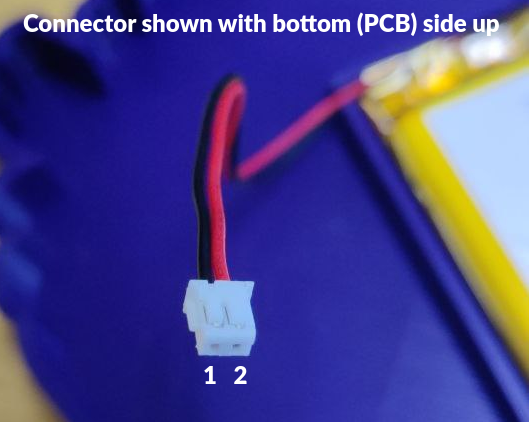
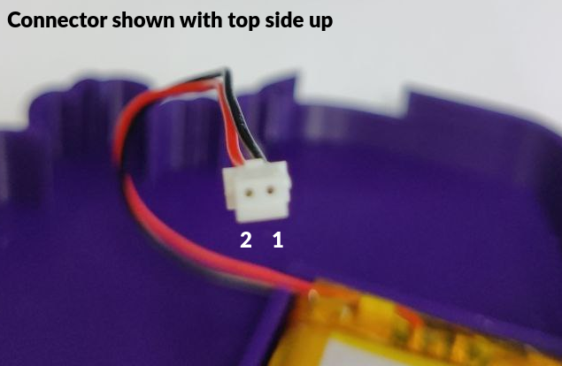
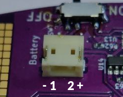
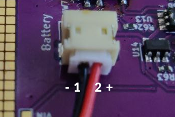

We use the [JST S2B-ZR-SM4A-TF](https://www.lcsc.com/product-detail/Wire-To-Board-Wire-To-Wire-Connector_JST-Sales-America-S2B-ZR-SM4A-TF-LF-SN_C265329.html) connector on our badges. This connector has two pins at 1.5mm pitch.

## Pinout

| Pin | Function | Wire color |
|-----|----------|------------|
| 1   | GND      | Black      |
| 2   | Vbatt    | Red        |

## Photos

