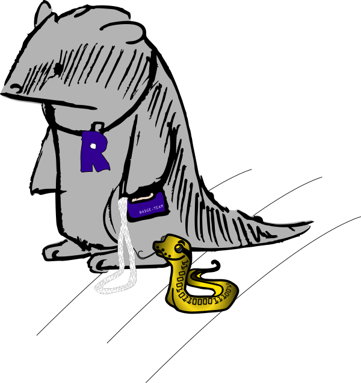

# MCH2022 is over, but The Badge lives on!

To [everyone who worked on the project](/team/), be it in
the past months or 1,5 years ago when we were still aiming for MCH2021: you
rock! We have received so many compliments on the design, the soft-/firmware,
the day 1 readiness, the website & docs, the specs and the overall end result:
whatever you did to contribute, you can be proud to be or to have been part of
this.  

To our [sponsors](https://github.com/badgeteam/mch2022-sponsors-slideshow) and
the people who arranged the sponsorships: we couldn't have done it without you.
To everyone who made apps or mods during camp: thank you for giving The Badge
its purpose. We hope to see even more in the future.  To everyone here: thank
you for being here, sharing our hype, giving your input and for making cool
things with the badge.

To those who are **missing something** in their badge kit: we'll work something
out. We have some batteries and lots of tangle strip (velcro) left. Update
Soon™ To those who **want an extra badge**: they will probably be sold in the
ticket shop, we'll share an update once we know more.

Please [**keep in touch**](/docs/badges/mch2022/support/), don't put The Badge
in a drawer, keep learning and hacking! We'll be around for questions, fixes,
improvements.

## Now back to our regular programming.
In all likelihood you came here because you want to learn how to get the most
out of your MCH2022 Badge...

Please proceed to the [**MCH2022 section**](badges/mch2022/), where we have
gathered all necessary information for you.

If you are having difficulties getting The Badge badge up and running, first
reread the [**Getting Started**](badges/mch2022/getting-started) instructions
then check our
[**Troubleshooting**](badges/mch2022/support/troubleshooting_faq) Hints. 

## In case you're here for another badge ...  

Uups, apologies. Don't forget that this site caters to quite a number of events
that have badges built on the same technology, in case you received such a
badge and are looking for pointers on how to use it, please proceed to [choose
your badge](badges).

All resource on this site are works-in-progress. Please let us know if you find
any errors or run into corner that could be explained more clearly by opening
an [issue](https://github.com/badgeteam/website/issues) or [pull
request](https://github.com/badgeteam/website/pulls) in the documentation
[website repo](https://github.com/badgeteam/website/). For example, this page
should revert to being a generic badge documentation site after
[MCH2022](https://wiki.mch2022.org/Main_Page).  Thanks!

